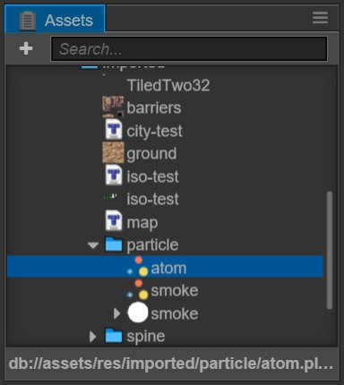
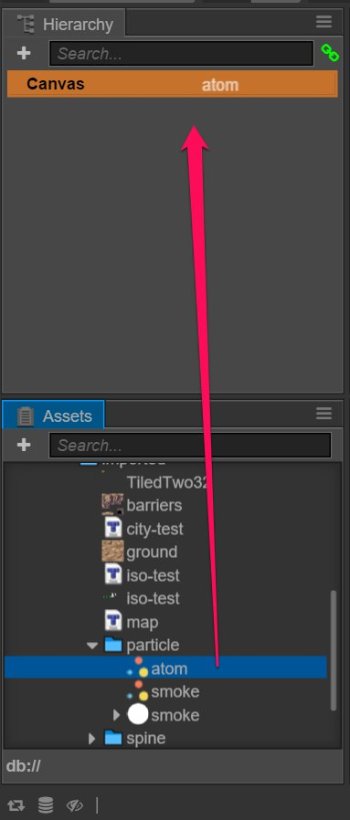

# Particle System

## Importing a particle asset

Put the Cocos2d-x supported particle `.plist` directly under the project `resource` directory.



## Adding a particle system to the scene

- Method 1: Drag and drop particle assets from **Assets** panel directly into the **Node Tree** panel.

  

- Method 2: Drag and drop particle assets from **Assets** directly into the **Scene**.

  

- Method 3: Add a **ParticleSystem** component to an existing node, and assign the particle assets from the **Assets** directly to the `File` property of the component.

  

> **Note**: the import of the `sourcePosition` property in the `.plist` file is not supported.

## Stored in the project

In order to improve the efficiency of resource management, it is recommended that you import `plist` and `png` (if you have a map) file in a separate directory, do not mix with other resources.

## Fixing render error

The png map file used by the particle or the built-in picture file in base64 format may have incorrect pre-multiplication information, causing the rendered particles to display the transparent area incorrectly. If this happens, manually modify the blendFuncSource property in the particle plist file to the following value:

```xml
<key>blendFuncSource</key>
<integer>770</integer>
```
