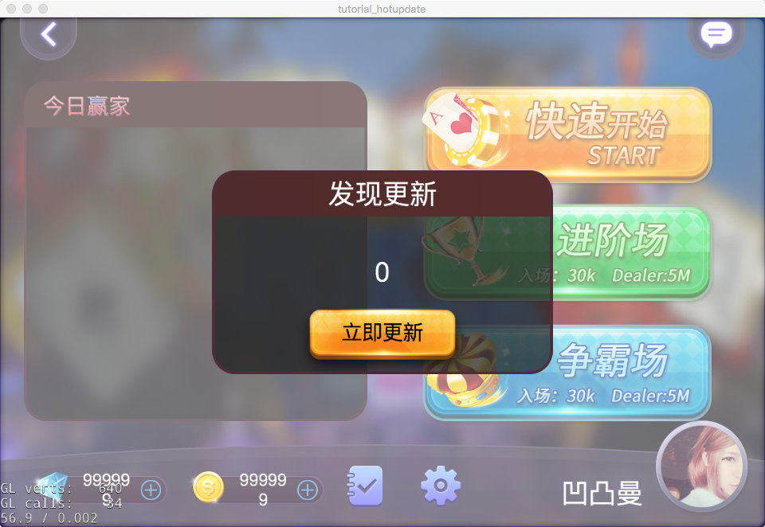

# 资源热更新教程

## 前言

之所以这篇文档的标题为教程，是因为目前 Cocos Creator 资源热更新的工作流还没有彻底集成到编辑器中，不过引擎本身对于热更新的支持是完备的，所以借助一些外围脚本和一些额外的工作就可以达成。

本篇文档的范例工程可以从 [GitHub](https://github.com/cocos-creator/tutorial-hot-update/tree/2.4.x) | [Gitee](https://gitee.com/mirrors_cocos-creator/tutorial-hot-update/tree/2.4.x) 获取。


## 使用场景和设计思路

资源热更新的使用场景相信游戏开发者都非常熟悉，对于已发布的游戏，在游戏内通过从服务器动态下载新的游戏内容，来时刻保持玩家对游戏的新鲜感，是保持一款游戏长盛不衰非常重要的手段。当然热更新还有一些其他的用途，不过在此不再深入讨论，我们下面将主要讨论 Cocos Creator 对热更新支持的原理和手段。

Cocos Creator 中的热更新主要源于 Cocos 引擎中的 AssetsManager 模块对热更新的支持。它有个非常重要的特点：

**服务端和本地均保存完整版本的游戏资源**，热更新过程中通过比较服务端和本地版本的差异来决定更新哪些内容。这样即可天然支持跨版本更新，比如本地版本为 A，远程版本是 C，则直接更新 A 和 C 之间的差异，并不需要生成 A 到 B 和 B 到 C 的更新包，依次更新。所以，在这种设计思路下，新版本的文件以离散的方式保存在服务端，更新时以文件为单位下载。

除此之外，由于 WEB 版本可以通过服务器直接进行版本更新，所以资源热更新只适用于原生发布版本。AssetsManager 类也只在 jsb 命名空间下，在使用的时候需要注意判断运行环境。

## Manifest 文件

对于不同版本的文件级差异，AssetsManager 中使用 Manifest 文件来进行版本比对。本地和远端的 Manifest 文件分别标示了本地和远端的当前版本包含的文件列表和文件版本，这样就可以通过比对每个文件的版本来确定需要更新的文件列表。

Manifest 文件中包含以下几个重要信息：

1. 远程资源包的根路径
2. 远程 Manifest 文件地址
3. 远程 Version 文件地址（非必需）
4. 主版本号
5. 文件列表：以文件路径来索引，包含文件版本信息，一般推荐用文件的 md5 校验码来作为版本号
6. 搜索路径列表

其中 Version 文件内容是 Manifest 文件内容的一部分，不包含文件列表。由于 Manifest 文件可能比较大，每次检查更新的时候都完整下载的话可能影响体验，所以开发者可以额外提供一个非常小的 Version 文件。AssetsManager 会首先检查 Version 文件提供的主版本号来判断是否需要继续下载 Manifest 文件并更新。

## 在 Cocos Creator 项目中支持热更新

在这篇教程中，将提出一种针对 Cocos Creator 项目可行的热更新方案，我们也在 cocos2d-x 的中开放了 Downloader 的 JavaScript 接口，用户可以自由开发自己的热更新方案。
对于 Cocos Creator 来说，所有 JS 脚本将会打包到 src 目录中，其他 Assets 资源将会被导出到 assets 目录。

基于这样的项目结构，本篇教程中的热更新思路很简单：

1. 基于原生打包目录中的 assets 和 src 目录生成本地 Manifest 文件。
2. 创建一个热更新组件来负责热更新逻辑。
3. 游戏发布后，若需要更新版本，则生成一套远程版本资源，包含 assets 目录、src 目录和 Manifest 文件，将远程版本部署到服务端。
4. 当热更新组件检测到服务端 Manifest 版本不一致时，就会开始热更新

教程所使用的范例工程是基于 21 点范例修改而来的，为了展示热更新的过程，将工程中的 table 场景（牌桌场景）删除，设为 1.0.0 版本。并在 `remote-assets` 目录中保存带有 table 场景的完整版本，设为 1.1.0 版本。游戏开始时会检查远程是否有版本更新，如果发现远程版本则提示用户更新，更新完成后，用户重新进入游戏即可进入牌桌场景。


> **注意**：项目中包含的 `remote-assets` 为 debug 模式，开发者在测试的时候必须使用 debug 模式构建项目才有效，否则 release 模式的 jsc 文件优先级会高于 `remote-assets` 中的资源而导致脚本失效。

### 使用 Version Generator 来生成 Manifest 文件

在范例工程中，我们提供了一个 **version_generator.js**（[GitHub](https://github.com/cocos-creator/tutorial-hot-update/blob/2.4.x/version_generator.js) | [Gitee](https://gitee.com/mirrors_cocos-creator/tutorial-hot-update/blob/2.4.x/version_generator.js)），这是一个用于生成 Manifest 文件的 NodeJS 脚本。使用方式如下：

```
> node version_generator.js -v 1.0.0 -u http://your-server-address/tutorial-hot-update/remote-assets/ -s native/package/ -d assets/
```

下面是参数说明：

- `-v` 指定 Manifest 文件的主版本号。
- `-u` 指定服务器远程包的地址，这个地址需要和最初发布版本中 Manifest 文件的远程包地址一致，否则无法检测到更新。
- `-s` 本地原生打包版本的目录相对路径。
- `-d` 保存 Manifest 文件的地址。

### 热更新组件

在范例工程中，热更新组件的实现位于 `assets/scripts/module/HotUpdate.js`（[GitHub](https://github.com/cocos-creator/tutorial-hot-update/blob/2.4.x/assets/scripts/module/HotUpdate.js) | [Gitee](https://gitee.com/mirrors_cocos-creator/tutorial-hot-update/blob/2.4.x/assets/scripts/module/HotUpdate.js)）中，开发者可以参考这种实现，也可以自由地按自己的需求修改。

除此之外，范例工程中还搭配了一个 `Canvas/update` 节点用于提示更新和显示更新进度供参考。


### 部署远程服务器

为了让游戏可以检测到远程版本，可以在本机上模拟一个远程服务器，搭建服务器的方案多种多样（比如 Python [SimpleHTTPServer](https://docs.python.org/2/library/simplehttpserver.html)），这里不做讨论，开发者可以使用自己习惯的方式。搭建成功后，访问远程包和 Manifest 文件的地址与范例工程中不同，所以需要修改以下几个地方来让游戏可以成功找到远程包：

1. `assets/project.manifest`：游戏的本地 Manifest 文件中的 `packageUrl`、`remoteManifestUrl` 和 `remoteVersionUrl`
2. `remote-assets/project.manifest`：远程包的 Manifest 文件中的 `packageUrl`、`remoteManifestUrl` 和 `remoteVersionUrl`
3. `remote-assets/version.manifest`：远程包的 Version 文件中的 `packageUrl`、`remoteManifestUrl` 和 `remoteVersionUrl`

### 打包原生版本

下载完成范例工程后，可以用 Cocos Creator 直接打开这个工程。打开 **构建发布** 面板，构建原生版本，建议使用 Windows / Mac 来测试。

> **注意**：
>
> 1. 构建时请不要勾选 MD5 Cache，否则会导致热更新无效。
> 2. 并且应该确保在工程目录的 packages 文件夹里导入 hot-update 编辑器插件（范例工程里已经导入了该插件）

该编辑器插件会在每次构建结束后，自动给 `main.js` 附加上搜索路径设置的逻辑和更新中断修复代码：

```js
// 在 main.js 的开头添加如下代码
(function () {
    if (typeof window.jsb === 'object') {
        var hotUpdateSearchPaths = localStorage.getItem('HotUpdateSearchPaths');
        if (hotUpdateSearchPaths) {
            var paths = JSON.parse(hotUpdateSearchPaths);
            jsb.fileUtils.setSearchPaths(paths);

            var fileList = [];
            var storagePath = paths[0] || '';
            var tempPath = storagePath + '_temp/';
            var baseOffset = tempPath.length;

            if (jsb.fileUtils.isDirectoryExist(tempPath) && !jsb.fileUtils.isFileExist(tempPath + 'project.manifest.temp')) {
                jsb.fileUtils.listFilesRecursively(tempPath, fileList);
                fileList.forEach(srcPath => {
                    var relativePath = srcPath.substr(baseOffset);
                    var dstPath = storagePath + relativePath;

                    if (srcPath[srcPath.length] == '/') {
                        jsb.fileUtils.createDirectory(dstPath)
                    }
                    else {
                        if (jsb.fileUtils.isFileExist(dstPath)) {
                            jsb.fileUtils.removeFile(dstPath)
                        }
                        jsb.fileUtils.renameFile(srcPath, dstPath);
                    }
                })
                jsb.fileUtils.removeDirectory(tempPath);
            }
        }
    }
})();
```

这一步是必须要做的原因是，热更新的本质是用远程下载的文件取代原始游戏包中的文件。Cocos2d-x 的搜索路径恰好满足这个需求，它可以用来指定远程包的下载地址作为默认的搜索路径，这样游戏运行过程中就会使用下载好的远程版本。另外，这里搜索路径是在上一次更新的过程中使用 `cc.sys.localStorage`（它符合 WEB 标准的 [Local Storage API](https://developer.mozilla.org/zh-CN/docs/Web/API/Window/localStorage)）固化保存在用户机器上，`HotUpdateSearchPaths` 这个键值是在 `HotUpdate.js` 中指定的，保存和读取过程使用的名字必须匹配。

此外，打开工程过程中如果遇到这个警告可以忽略：`loader for [.manifest] not exists!`。

### 运行范例工程

如果一切正常，此时运行原生版本的范例工程，就会发现检测到新版本，提示更新，更新之后会自动重启游戏，此时可进入 table 场景。



## 结语

以上介绍的是目前一种可能的热更新方案，Cocos Creator 在未来版本中提供更成熟的热更新方案，直接集成到编辑器中。当然，也会提供底层 Downloader API 来允许用户自由实现自己的热更新方案，并通过插件机制在编辑器中搭建完整可视化的工作流。这篇教程和范例工程提供给大家参考，也鼓励开发者针对自己的工作流进行定制。如果有问题和交流也欢迎反馈到 [论坛](https://forum.cocos.org/c/27)。

## Next Step

[热更新管理器文档](assets-manager.md)
