# 快速上手：制作第一个游戏

您正在阅读的手册文档包括了系统化的介绍 Cocos Creator 的编辑器界面、功能和工作流程，但如果您想快速上手体验使用 Cocos Creator 开发游戏的大体流程和方法，这一章将满足您的好奇心。完成本章教程之后，您应该能获得足够上手制作游戏的信息，不过我们还是推荐您继续阅读本手册来了解各个功能模块的细节和完整的工作流程。

接下来就让我们开始吧，跟随教程我们将会制作一款名叫 **摘星星** 的小游戏。这款游戏的玩家要操作一个反应 **迟钝** 却蹦跳不停的小怪物来碰触不断出现的星星，难以驾驭的加速度将给玩家带来很大挑战，和您的小伙伴比比谁能拿到更多星星吧！

可以在这里感受一下这款游戏的完成形态：

<http://fbdemos.leanapp.cn/star-catcher/>

## 准备项目和资源

我们已经为您准备好了制作这款游戏需要的全部资源，下载 **初始项目** 后，解压到您希望的位置，之后我们就可以开始了：

**下载初始项目 `start_project`**：[GitHub](https://github.com/cocos-creator/tutorial-first-game/tree/v2.4) | [Gitee](https://gitee.com/mirrors_cocos-creator/tutorial-first-game/tree/v2.4)

您也可以下载最终完成的项目，跟随教程制作过程中有任何不明白的地方都可以打开完成版的项目作为参考：

**下载完成项目 `complete_project`**：[GitHub](https://github.com/cocos-creator/tutorial-first-game/tree/v2.4) | [Gitee](https://gitee.com/mirrors_cocos-creator/tutorial-first-game/tree/v2.4)

## 打开初始项目

如果您还不了解如何获取和启动 Cocos Creator，请阅读 [安装和启动](install.md) 一节。

1. 首先启动 Cocos Creator，然后在 Dashboard 中选择 **打开其他项目**。
2. 在弹出的文件夹选择对话框中，选中我们刚才下载并解压完成的 **start_project**，点击 **打开** 按钮。
3. Cocos Creator 编辑器主窗口会打开，我们将看到如下的项目状态：

    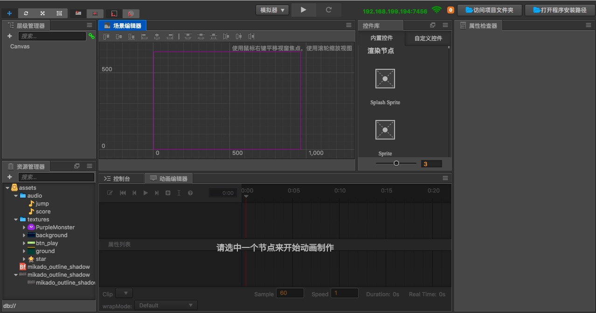

## 检查游戏资源

我们的初始项目中已经包含了所有需要的游戏资源，因此您不需要再导入任何其他资源。如果希望了解导入资源的方法，可以阅读 [资源工作流程](../asset-workflow/index.md) 的相关内容。

下面我们先来了解一下项目中都有哪些资源，请关注名为 **资源管理器** 的面板，这里显示的是项目中所有资源的树状结构。

可以看到，项目资源的根目录名叫 **assets**，对应我们解压之后初始项目中的 `assets` 目录，只有这个目录下的资源才会显示在 Creator 编辑器的 **资源管理器** 面板中。

**资源管理器** 可以显示任意层次的目录结构，我们可以看到  这样的图标就代表一个文件夹，点击文件夹左边的三角图标可以展开文件夹的内容。将文件夹全部展开后，**资源管理器** 会呈现如下图的状态：

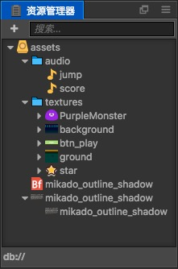

每个资源都是一个文件，导入项目后编辑器会根据资源扩展名识别出不同的资源类型，并且资源图标也会有所区别。项目中资源的类型和作用包括：

-  声音文件，一般为 mp3 文件。在这个教程中，我们会分别在主角跳跃和得分时播放名为 `jump` 和 `score` 的声音文件。
-  位图字体，由 `fnt` 文件和同名的 `png` 图片文件共同组成。**位图字体（Bitmap Font）** 是一种游戏开发中常用的字体资源，详情可参考 [位图字体资源](../asset-workflow/font.md)。
- 各式各样的缩略图标，这些都是图像资源，一般是 `png` 或 `jpg` 文件。图片文件导入项目后会经过简单的处理成为 **texture** 类型的资源。之后就可以将这些资源拖拽到场景或组件属性中使用了。

## 创建游戏场景

在 Cocos Creator 中，**游戏场景（Scene）** 是开发时组织游戏内容的中心，也是呈现给玩家所有游戏内容的载体。游戏场景中一般会包括以下内容：

- 场景图像和文字（Sprite、Label）
- 角色
- 以组件形式附加在场景节点上的游戏逻辑脚本

当玩家运行游戏时，就会载入游戏场景，游戏场景加载后就会自动运行所包含组件的游戏脚本，实现各种各样开发者设置的逻辑功能。所以除了资源以外，游戏场景是一切内容创作的基础。现在，让我们来新建一个场景。

1. 在 **资源管理器** 中点击选中 `assets` 文件夹，确保我们的场景会被创建在这个目录下

2. 点击 **资源管理器** 左上角的加号按钮，在弹出的菜单中选择 **Scene**。或者也可以直接右键点击 `asset` 目录，选择 **新建 -> Scene**。

    
  
3. 然后在 **资源管理器** 中就会生成一个名为 `New Scene` 的场景文件，并且名称会处于编辑状态，将它重命名为 `game`。

4. 双击 `game`，就会在 **场景编辑器** 中打开这个场景。

### 了解 Canvas

打开场景后，**层级管理器** 中会显示当前场景中的所有节点和它们的层级关系。我们刚刚新建的场景中有一个名为 `Canvas` 的节点，`Canvas` 也可以称为画布节点或渲染根节点，点击选中 `Canvas`，可以在 **属性检查器** 中看到它的属性。


这里的 `Design Resolution` 属性规定了游戏的设计分辨率，`Fit Height` 和 `Fit Width` 规定了在不同尺寸的屏幕上运行时，我们将如何缩放 `Canvas` 以适配不同的分辨率。

由于提供了多分辨率适配的功能，我们一般会将场景中的所有负责图像显示的节点都放在 `Canvas` 下面。这样当作为父节点的 `Canvas` 的 `scale`（缩放）属性改变时，所有作为其子节点的图像也会跟着一起缩放以适应不同屏幕的大小。

更详细的内容请参考 [Canvas 组件参考](../components/canvas.md)。目前我们只要知道接下来添加的场景图像都会放在 `Canvas` 节点下面就可以了。

## 设置场景图像

### 添加背景

首先在 **资源管理器** 中按照 `assets/textures/background` 的路径找到我们的背景图像资源，点击并拖拽这个资源到 **层级管理器** 中的 `Canvas` 节点上，直到 `Canvas` 节点显示橙色高亮，表示这个资源将会被添加为 Canvas 的子节点。

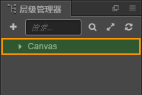

这时松开鼠标按键，可以看到 `Canvas` 下面添加了一个名为 `background` 的节点。当我们使用拖拽资源的方式添加节点时，节点会自动以贴图资源的文件名来命名。

我们在对场景进行编辑修改时，可以通过主菜单 **文件 -> 保存场景** 来及时保存我们的修改。也可以使用快捷键 <kbd>Ctrl + S</kbd>（Windows）或 <kbd>Cmd + S</kbd>（Mac）来保存。

#### 修改背景尺寸

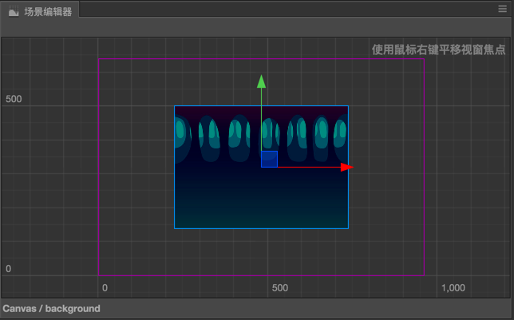

在 **场景编辑器** 中，可以看到我们刚刚添加的背景图像，下面我们会通过修改 `background` 背景图像的尺寸，使它覆盖整个屏幕。

1. 首先选中 `background` 节点，然后点击主窗口左上角工具栏第四个 [矩形变换工具](./basics/editor-panels/scene.md#%E7%9F%A9%E5%BD%A2%E5%8F%98%E6%8D%A2%E5%B7%A5%E5%85%B7)，使用这个工具我们可以方便的修改图像节点的尺寸。

    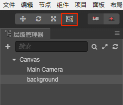

2. 将鼠标移动到 **场景编辑器** 中背景图的左边（两端有蓝点的白色线框），按住并向左拖拽直到背景图的左边超出表示设计分辨率的紫色线框，然后再用同样的方法向右拖拽背景图的右边。

    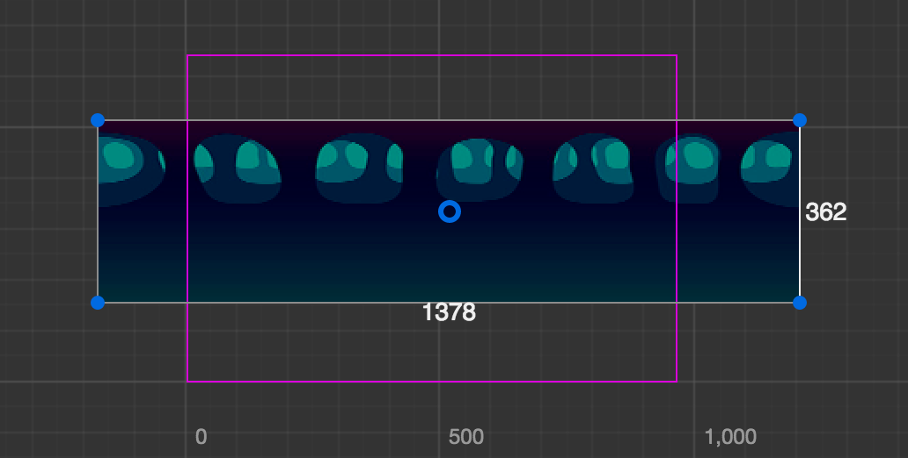

3. 然后拖拽背景图的上下两边，使背景图的大小能够填满设计分辨率的紫色线框。

    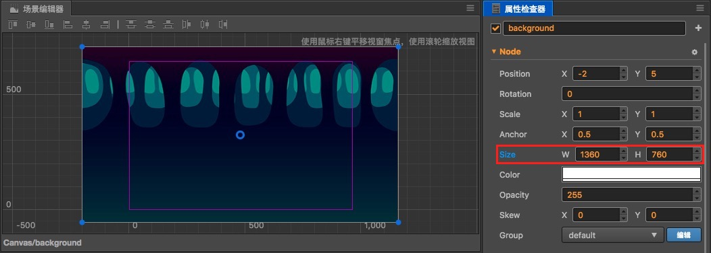

在使用 **矩形变换工具** 修改背景图尺寸时，在 **属性检查器** 中可以看到 **Node**（节点）中的 `Size` 属性也在随之变化。修改完成后我们的背景图尺寸大概是 **(1360, 760)**。您也可以直接在 `Size` 属性的输入框中输入数值，和使用 **矩形变换工具** 一样可以达到同样的效果。这样大小的背景图在市面流行的手机上都可以覆盖整个屏幕，不会出现穿帮情况。

### 添加地面

我们的主角需要一个可以在上面跳跃的地面，拖拽 **资源管理器** 中的 `assets/textures/ground` 资源到 **层级管理器** 的 `Canvas` 节点中。<br>
这次在拖拽时我们还可以选择新添加的节点和 `background` 节点的顺序关系。拖拽资源的状态下移动鼠标指针到 `background` 节点的下方，直到在 `Canvas` 上显示橙色高亮框，并同时在 `background` 下方显示表示插入位置的绿色线条，然后松开鼠标，这样 `ground` 在节点层级中就被放在了 `background` 下方，同时也是 `Canvas` 下的一个子节点。


在 **层级管理器** 中，显示在下方的节点的渲染顺序是在上方节点的后面，也就是说下方的节点是在上方节点之后绘制的。我们可以看到位于 **层级管理器** 最下方的 `ground` 节点，在 **场景编辑器** 的层级中显示在了最前，也就是在 `background` 的上面。另外，在场景中子节点也会永远显示在父节点的上面，我们可以随时调整节点的层级顺序和关系来控制它们的显示顺序。

#### 修改地面尺寸及位置

我们可以按照修改 `background` 节点的方法使用 **矩形变换工具** 为 `ground` 节点设置一个合适的大小。<br>
然后使用主窗口左上角工具栏中的第一个 [移动变换工具](./basics/editor-panels/scene.md#%E7%A7%BB%E5%8A%A8%E5%8F%98%E6%8D%A2%E5%B7%A5%E5%85%B7) 来改变节点的位置：


尝试按住 **移动工具** 显示在节点上的箭头并拖拽，就可以一次改变节点在单个坐标轴上的位置。

下图是我们设置好的地面节点状态：


我们在设置 `background` 和 `ground` 节点的位置和尺寸时不需要很精确的数值，可以凭感觉拖拽。如果您偏好比较完整的数字，也可以参考截图直接输入 `Position` 和 `Size` 的数值。

### 添加主角

接下来我们的主角小怪兽要登场了。首先从 **资源管理器** 拖拽 `assets/texture/PurpleMonster` 到 **层级管理器** 中的 `Canvas` 下面，并确保它的排序在 `ground` 之下，这样我们的主角在场景中会显示在最前面。注意小怪兽节点应该是 `Canvas` 的子节点，和 `ground` 节点平行。

为了让主角的光环在场景节点中非常醒目，右键点击刚刚添加的 `PurpleMonster` 节点，选择 **重命名**，将其改名为 `Player`。

然后我们需要对主角的属性进行一些设置，首先是改变 `锚点（Anchor）` 的位置。默认状态下，任何节点的锚点都会在节点的中心，也就是说该节点中心点所在的位置就是该节点的位置。而我们希望通过控制主角 **底部** 的位置来模拟在地面上跳跃的效果，所以现在我们需要把主角的锚点设置在底部。在 **属性检查器** 里找到 **Anchor** 属性，把其中的 `y` 值设为 `0`，可以看到 **场景编辑器** 中，表示主角位置的 **移动工具** 的箭头出现在了主角底部。

注意锚点的取值，当锚点的取值为（0，0）时表示锚点在节点的左下角，锚点的取值为（1，1）时表示锚点在节点的右上角，锚点的取值为（0.5，0.5）时表示锚点在节点的中心，以此类推。

接下来在 **场景编辑器** 中拖拽 `Player`，将它放在地面上，效果如下图：


这样我们基本的场景美术内容就配置好了。下面一节我们要编写代码让游戏里的内容生动起来。

## 编写主角脚本

Cocos Creator 开发游戏的一个核心理念就是让内容生产和功能开发可以流畅的并行协作，我们在上个部分着重于处理美术内容，而接下来就是通过编写脚本来开发功能的流程，之后我们还会看到写好的程序脚本可以很容易地被内容生产者使用。

如果您从没写过程序也不用担心，我们会在教程中提供所有需要的代码，只要复制粘贴到正确的位置就可以了，之后这部分工作可以找您的程序员小伙伴来解决。下面让我们开始创建驱动主角行动的脚本吧。

### 创建脚本

1. 首先在 **资源管理器** 中右键点击 `assets` 文件夹，选择 **新建 -> 文件夹**，会生成一个名为 `New Folder` 的文件夹

    

2. 右键点击 `New Folder`，选择 **重命名** 将其重命名为 `scripts`，之后我们所有的脚本都会存放在这个文件夹中

3. 右键点击 `scripts` 文件夹，选择 **新建 -> JavaScript**，创建一个 JavaScript 脚本

4. 将新建脚本的名字重命名为 `Player`，双击这个脚本，打开 [代码编辑器](./basics/editor-panels/preferences.md#%E6%95%B0%E6%8D%AE%E7%BC%96%E8%BE%91)

    > **注意**：Cocos Creator 中脚本的名称就是组件的名称，这个命名是大小写敏感的！如果组件名称的大小写不正确，将无法正确通过名称使用组件！

### 编写组件属性

在打开的 `Player` 脚本里已经有了预先设置好的一些代码块，如下所示：

```js
cc.Class({
    extends: cc.Component,

    properties: {
        // foo: {
        //     // ATTRIBUTES:
        //     default: null,        // The default value will be used only when the component attaching
        //                           // to a node for the first time
        //     type: cc.SpriteFrame, // optional, default is typeof default
        //     serializable: true,   // optional, default is true
        // },
        // bar: {
        //     get () {
        //         return this._bar;
        //     },
        //     set (value) {
        //         this._bar = value;
        //     }
        // },
    },

    // LIFE-CYCLE CALLBACKS:

    // onLoad () {},

    start () {

    },

    // update (dt) {},
});
```

我们来大概了解一下这些代码的作用。首先我们可以看到一个全局的 `cc.Class()` 方法，什么是 `cc` 呢？`cc` 是 Cocos 的简称，Cocos 引擎的主要命名空间，引擎代码中所有的类、函数、属性和常量都在这个命名空间中定义。而 `Class()` 就是 `cc` 模块下的一个方法，这个方法用于声明 Cocos Creator 中的类。为了方便区分，我们把使用 `cc.Class` 声明的类叫做 `CCClass`。`Class()` 方法的参数是一个原型对象，在原型对象中以键值对的形式设定所需的类型参数，就能创建出所需要的类。例如：

```js
var Sprite = cc.Class({
    name: "sprite"
});
```

以上代码用 `cc.Class()` 方法创建了一个类型，并且赋给了 `Sprite` 变量。同时还将类名设为 `sprite`。类名用于序列化，一般可以省略。

更多关于 `cc.Class` 的内容可以参考 [使用 cc.Class 声明类型](../scripting/class.md)。

现在我们回到代码编辑器继续看刚才的代码，这些代码就是编写一个组件（脚本）所需的结构。具有这样结构的脚本就是 Cocos Creator 中的 **组件（Component）**，它们能够挂载到场景中的节点上，控制节点的各种功能。我们先来设置一些属性，然后看看怎样在场景中调整它们。

找到 `Player` 脚本里的 `properties` 部分，将其改为以下内容并保存：

```js
// Player.js
    //...
    properties: {
        // 主角跳跃高度
        jumpHeight: 0,
        // 主角跳跃持续时间
        jumpDuration: 0,
        // 最大移动速度
        maxMoveSpeed: 0,
        // 加速度
        accel: 0,
    },
    //...
```

Cocos Creator 规定一个节点具有的属性都需要写在 `properties` 代码块中，这些属性将规定主角的移动方式，在代码中我们不需要关心这些数值是多少，因为我们之后会直接在 **属性检查器** 中设置这些数值。以后在游戏制作过程中，我们可以将需要随时调整的属性都放在 `properties` 中。

现在我们可以把 `Player` 组件添加到主角节点上。在 **层级管理器** 中选中 `Player` 节点，然后在 **属性检查器** 中点击最下方的 **添加组件** 按钮，选择 **用户脚本组件 -> Player**，为主角节点添加 `Player` 组件。

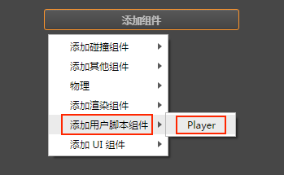

现在我们可以在 **属性检查器** 中（需要先在 **层级管理器** 中选中 `Player` 节点）看到刚添加的 `Player` 组件了，按照下图将主角跳跃和移动的相关属性设置好：

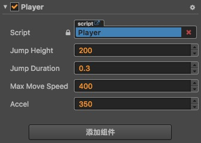

这些数值除了 `jumpDuration` 的单位是 **秒** 之外，其他的数值都是以 **像素** 为单位的。根据我们现在对 `Player` 组件的设置，我们的主角将能够跳跃 200 像素的高度，起跳到最高点所需的时间是 0.3 秒，最大水平方向移动速度是 400 像素每秒，水平加速度是 350 像素每秒。

这些数值都是建议，一会等游戏运行起来后，您完全可以按照自己的喜好随时在 **属性检查器** 中修改这些数值，不需要改动任何代码。

### 编写跳跃和移动代码

接下来我们在 `properties: {...},` 代码块的下面，添加一个叫做 `runJumpAction` 的方法让主角跳跃起来：

```js
// Player.js
    properties: {
        //...
    },

    runJumpAction () {
        // 跳跃上升
        var jumpUp = cc.tween().by(this.jumpDuration, {y: this.jumpHeight}, {easing: 'sineOut'});
        // 下落
        var jumpDown = cc.tween().by(this.jumpDuration, {y: -this.jumpHeight}, {easing: 'sineIn'});

        // 创建一个缓动，按 jumpUp、jumpDown 的顺序执行动作
        var tween = cc.tween().sequence(jumpUp, jumpDown)
        // 不断重复
        return cc.tween().repeatForever(tween);
    },
```

这里涉及到了 **缓动（cc.tween）系统**，在 Cocos Creator 中，`cc.tween` 可以对任何对象进行操作，并且可以对对象的 **任意属性** 进行缓动。

例如在上面的代码中，`by()` 方法的作用是对属性进行相对值计算，表示的是变化值。具体的内容可参考文档 [缓动系统](../scripting/tween.md) 以及 API 文档 [Tween 类型](../../../api/zh/classes/Tween.html)。

接下来在 `onLoad` 方法中调用刚刚添加的 `runJumpAction` 方法，然后调用 `start` 来开始动作：

```js
// Player.js
    onLoad: function () {
        var jumpAction = this.runJumpAction();
        cc.tween(this.node).then(jumpAction).start()
    },
```

`onLoad` 方法会在场景加载后立刻执行，所以初始化相关的操作和逻辑都会放在这里面。我们首先将循环跳跃的动作传给了 `jumpAction` 变量，然后将其插入到 `cc.tween` 对节点（主角）进行缓动的队列中，再调用 `start` 开始执行 `cc.tween`，从而让节点（主角）一直跳跃。

脚本修改完成后记得保存，然后返回 Creator 编辑器，我们就可以开始第一次运行游戏了！<br>
点击编辑器上方正中的 **预览游戏** 按钮：


Cocos Creator 会自动打开您的默认浏览器并开始在里面运行游戏，现在应该可以看到我们的主角 —— 紫色小怪兽在场景中间活泼地蹦个不停了。

### 移动控制

只能在原地傻蹦的主角可没前途，让我们为主角添加键盘输入，用 <kbd>A</kbd> 和 <kbd>D</kbd> 来控制它的跳跃方向。在 `runJumpAction` 方法的下面添加键盘事件响应函数 `onKeyUp` 和 `onKeyDown`：

```js
// Player.js
    runJumpAction: function () {
        //...
    },

    onKeyDown (event) {
        // set a flag when key pressed
        switch(event.keyCode) {
            case cc.macro.KEY.a:
                this.accLeft = true;
                break;
            case cc.macro.KEY.d:
                this.accRight = true;
                break;
        }
    },

    onKeyUp (event) {
        // unset a flag when key released
        switch(event.keyCode) {
            case cc.macro.KEY.a:
                this.accLeft = false;
                break;
            case cc.macro.KEY.d:
                this.accRight = false;
                break;
        }
    },
```

然后修改 `onLoad` 方法，在其中加入向左和向右加速的开关，以及主角当前在水平方向的速度。最后再调用 `cc.systemEvent`，在场景加载后就开始监听键盘输入：

```js
// Player.js
    onLoad: function () {
        // 初始化跳跃动作
        var jumpAction = this.runJumpAction();
        cc.tween(this.node).then(jumpAction).start()

        // 加速度方向开关
        this.accLeft = false;
        this.accRight = false;
        // 主角当前水平方向速度
        this.xSpeed = 0;

        // 初始化键盘输入监听
        cc.systemEvent.on(cc.SystemEvent.EventType.KEY_DOWN, this.onKeyDown, this);
        cc.systemEvent.on(cc.SystemEvent.EventType.KEY_UP, this.onKeyUp, this);   
    },

    onDestroy () {
        // 取消键盘输入监听
        cc.systemEvent.off(cc.SystemEvent.EventType.KEY_DOWN, this.onKeyDown, this);
        cc.systemEvent.off(cc.SystemEvent.EventType.KEY_UP, this.onKeyUp, this);
    },  
```

这里在 `systemEvent` 中注册了键盘响应函数（`onKeyDown`、`onKeyUp`），在函数中通过 `switch` 判断键盘上的 <kbd>A</kbd> 或 <kbd>D</kbd> 是否被按下或松开，若按下就执行对应的操作。<br>
有 Android 开发经验的同学比较好理解，这里的监听器实质上就和 Android 里的 `OnClickListener` 差不多，Creator 通过 `systemEvent` 来监听 [系统全局事件](../scripting/player-controls.md)。关于鼠标、触摸和自定义事件的监听和派发，详细内容请参考 [监听和发射事件](../scripting/events.md)。

最后修改 `update` 方法中的内容，添加加速度、速度和主角当前位置的设置：

```js
// Player.js
    update: function (dt) {
        // 根据当前加速度方向每帧更新速度
        if (this.accLeft) {
            this.xSpeed -= this.accel * dt;
        }
        else if (this.accRight) {
            this.xSpeed += this.accel * dt;
        }

        // 限制主角的速度不能超过最大值
        if (Math.abs(this.xSpeed) > this.maxMoveSpeed) {
            // if speed reach limit, use max speed with current direction
            this.xSpeed = this.maxMoveSpeed * this.xSpeed / Math.abs(this.xSpeed);
        }

        // 根据当前速度更新主角的位置
        this.node.x += this.xSpeed * dt;
    },
```

`update` 会在场景加载后每帧调用一次，我们一般把需要经常计算或及时更新的逻辑内容放在 `update` 中。在我们的游戏里，根据键盘输入获得加速度方向后，就需要每帧在 `update` 中计算主角的速度和位置。

保存脚本后，返回编辑器点击上方的 **预览** 按钮来看看我们最新的成果。在浏览器打开预览后，**用鼠标点击一下游戏画面（这是浏览器的限制，要点击游戏画面才能接受键盘输入）**，然后就可以按 <kbd>A</kbd> 和 <kbd>D</kbd> 键来控制主角左右移动了！

感觉移动起来有点迟缓？主角跳的不够高？希望跳跃时间长一些？没问题，这些都可以随时调整。只要为 `Player` 组件设置不同的属性值，就可以按照您的想法调整游戏。这里有一组设置可供参考：

```js
Jump Height: 150
Jump Duration: 0.3
Max Move Speed: 400
Accel: 1000
```

这组属性设置会让主角变得灵活无比，至于如何选择，就看您想做一个什么风格的游戏了。

## 制作星星

主角现在可以跳来跳去了，我们要给玩家一个目标，也就是会不断出现在场景中的星星，玩家需要引导小怪兽碰触星星来收集分数。被主角碰到的星星会消失，然后马上在随机位置重新生成一个。

### 制作 Prefab

对于需要重复生成的节点，我们可以将它保存成 **Prefab（预制）** 资源，作为我们动态生成节点时使用的模板。关于 **Prefab** 的更多信息，请参考 [预制资源（Prefab）](../asset-workflow/prefab.md)。

首先从 **资源管理器** 中拖拽 `assets/textures/star` 图片到场景中，位置随意。我们只是需要借助场景作为我们制作 Star Prefab 的工作台，制作完成后我们会把这个节点从场景中删除。

我们不需要修改星星的位置或渲染属性，但要让星星在被主角碰触后消失，就需要为星星也添加一个专门的脚本组件。和添加 `Player` 脚本的方法相同，在 **资源管理器** 的 `assets/scripts` 中创建一个 JavaScript 脚本并重命名为 `Star`。

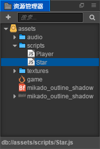

接下来双击这个脚本开始编辑，星星组件只需要一个属性用来规定主角距离星星多近时就可以完成收集。修改 `properties`，加入以下内容并保存脚本。

```js
// Star.js
    properties: {
        // 星星和主角之间的距离小于这个数值时，就会完成收集
        pickRadius: 0,
    },
```

将这个脚本添加到刚创建的 star 节点上，在 **层级管理器** 中选中 star 节点，然后在 **属性检查器** 最下方点击 **添加组件** 按钮，选择 **用户脚本组件 -> Star**，该脚本便会添加到刚创建的 star 节点上。然后把 `Pick Radius` 属性值设为 `60` 并保存场景。


此时 Star Prefab 需要的设置就完成了，现在从 **层级管理器** 中将 star 节点拖拽到 **资源管理器** 中的 `assets` 文件夹下，就生成了名为 `star` 的 Prefab 资源。

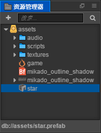

现在可以从场景中删除 star 节点了，删除完成后保存场景。后续可以直接双击这个 `star` Prefab 资源进行编辑。

接下去我们会在脚本中动态使用星星的 Prefab 资源生成星星。

### 添加游戏控制脚本

星星的生成是游戏主逻辑的一部分，所以我们要创建一个叫做 `Game` 的脚本作为游戏主逻辑脚本，这个脚本之后还会添加计分、游戏失败和重新开始的相关逻辑。

添加 `Game` 脚本到 `assets/scripts` 文件夹下，双击打开脚本。首先添加生成星星所需的属性：

```js
// Game.js
    properties: {
        // 这个属性引用了星星预制资源
        starPrefab: {
            default: null,
            type: cc.Prefab
        },

        // 星星产生后消失时间的随机范围
        maxStarDuration: 0,
        minStarDuration: 0,

        // 地面节点，用于确定星星生成的高度
        ground: {
            default: null,
            type: cc.Node
        },
    
        // Player 节点，用于获取主角弹跳的高度，和控制主角行动开关
        player: {
            default: null,
            type: cc.Node
        }
    },
```

这里初学者可能会疑惑，为什么像 `starPrefab` 这样的属性会用 `{}` 括起来，括号里面还有新的 “属性” 呢？其实这是属性的一种完整声明，之前我们的属性声明都是不完整的，有些情况下，我们需要为属性声明添加参数，这些参数控制了属性在 **属性检查器** 中的显示方式，以及属性在场景序列化过程中的行为。例如：

```js
properties: {
    score: {
        default: 0,
        displayName: "Score (player)",
        tooltip: "The score of player",
    }
}
```

以上代码为 `score` 属性设置了三个参数：

- `default` —— 指定了 `score` 的默认值（default）为 0。
- `displayName` —— 指定了在 **属性检查器** 中，其属性名（`displayName`）将显示为 `Score (player)`。
- `tooltip` —— 当鼠标在 **属性检查器** 中移到参数上时，显示对应的 `tooltip`。

下面是属性声明的常用参数：

`default`：设置属性的默认值，这个默认值仅在组件第一次添加到节点上时才会用到<br>
`type`：限定属性的数据类型，详见 [CCClass 进阶参考：type 参数](../scripting/reference/class.md#type-%E5%8F%82%E6%95%B0)<br>
`visible`：设为 false 时，不在 **属性检查器** 中显示该属性<br>
`serializable`：设为 false 则不序列化（保存）该属性<br>
`displayName`：在 **属性检查器** 中显示指定的属性名<br>
`tooltip`：在 **属性检查器** 中添加属性的 tooltip

所以上面的代码就容易理解了：

```js
starPrefab: {
    default: null,
    type: cc.Prefab
},
```

首先在 Game 组件下声明了 `starPrefab` 属性，这个属性默认值为 `null`，传入的类型必须是 Prefab 预制资源类型。这样之后的 ground 和 player 属性也可以理解了。

保存脚本后将 Game 组件添加到 **层级管理器** 中的 Canvas 节点上（选中 Canvas 节点后，拖拽脚本到 **属性检查器** 上，或者点击 **属性检查器** 的 **添加组件** 按钮，并从 **用户脚本组件** 中选择 `Game`。）

接下来从 **资源管理器** 中拖拽 `star` 的 Prefab 资源到 Game 组件的 `Star Prefab` 属性中。这是我们第一次为属性设置引用，只有在属性声明时规定 `type` 为引用类型时（比如我们这里写的 `cc.Prefab` 类型），才能够将资源或节点拖拽到该属性上。

接着从 **层级管理器** 中拖拽 ground 和 Player 节点到 Canvas 节点 Game 组件中相对应名字的属性上，完成节点引用。

然后设置 `Min Star Duration` 和 `Max Star Duration` 属性的值为 `3` 和 `5`，之后星星在消失前存在的时间，会在这两个数之间随机取值。

### 在随机位置生成星星

接下来我们继续修改 Game 脚本，在 `onLoad` 方法 **后面** 添加生成星星的逻辑：

```js
// Game.js
    onLoad: function () {
        // 获取地平面的 y 轴坐标
        this.groundY = this.ground.y + this.ground.height/2;
        // 生成一个新的星星
        this.spawnNewStar();
    },

    spawnNewStar: function() {
        // 使用给定的模板在场景中生成一个新节点
        var newStar = cc.instantiate(this.starPrefab);
        // 将新增的节点添加到 Canvas 节点下面
        this.node.addChild(newStar);
        // 为星星设置一个随机位置
        newStar.setPosition(this.getNewStarPosition());
    },

    getNewStarPosition: function () {
        var randX = 0;
        // 根据地平面位置和主角跳跃高度，随机得到一个星星的 y 坐标
        var randY = this.groundY + Math.random() * this.player.getComponent('Player').jumpHeight + 50;
        // 根据屏幕宽度，随机得到一个星星 x 坐标
        var maxX = this.node.width/2;
        randX = (Math.random() - 0.5) * 2 * maxX;
        // 返回星星坐标
        return cc.v2(randX, randY);
    },
```

这里需要注意几个问题：

1. 节点下的 `y` 属性对应的是锚点所在的 `y` 坐标，因为锚点默认在节点的中心，所以需要加上地面高度的一半才是地面的 `y` 坐标。
2. `instantiate()` 用于克隆指定的任意类型的对象，或者从 Prefab 实例化出新节点。返回值为 Node 或者 Object。
3. `addChild()` 用于在节点下添加一个新的子节点，所以新节点在场景中的显示效果在该节点之上。
4. Node 下的 `setPosition()` 用于设置节点在父节点坐标系中的位置，有以下两种方式：
    - 传入两个数值 x 和 y
    - 传入 `cc.v2(x, y)` 或 `cc.v3(x, y, z)`（类型为 `cc.Vec2` 或 `cc.Vec3` 的对象）
5. 通过 Node 下的 `getComponent()` 可以得到该节点上挂载的组件引用。

保存脚本以后返回编辑器，点击 **预览游戏** 按钮，在浏览器中可以看到，游戏开始后动态生成了一颗星星！用同样的方法，您可以在游戏中动态生成任何预先设置好的以 `Prefab` 为模板的节点。


### 添加主角碰触收集星星的行为

添加主角收集星星的行为逻辑，重点在于星星要随时获得主角节点的位置，才能判断它们之间的距离是否在可收集距离的范围内。如何获得主角节点的引用呢？别忘了我们前面做过的两件事：

1. Game 组件中有个名叫 `player` 的属性，保存了主角节点的引用。
2. 每个星星都是在 Game 脚本中动态生成的。

所以我们只要在 Game 脚本生成 `Star` 节点实例时，将实例传入 Star 脚本组件并保存起来就好了，之后我们可以随时通过 `game.player` 来访问主角节点。

让我们打开 Game 脚本，在 `spawnNewStar` 方法中 **最后面** 添加一句 `newStar.getComponent('Star').game = this;`，如下所示：

```js
// Game.js
spawnNewStar: function() {
    // ...
    // 在星星脚本组件上保存 Game 对象的引用
    newStar.getComponent('Star').game = this;
},
```

添加完成并保存后，打开 Star 脚本，现在我们可以利用 Game 组件中引用的 Player 节点来判断距离了。在 `onLoad` 方法的 **后面** 添加名为 `getPlayerDistance` 和 `onPicked` 的方法：

```js
// Star.js
    getPlayerDistance: function () {
        // 根据 Player 节点位置判断距离
        var playerPos = this.game.player.getPosition();
        // 根据两点位置计算两点之间距离
        var dist = this.node.position.sub(playerPos).mag();
        return dist;
    },

    onPicked: function() {
        // 当星星被收集时，调用 Game 脚本中的接口，生成一个新的星星
        this.game.spawnNewStar();
        // 然后销毁当前星星节点
        this.node.destroy();
    },
```

Node 下的 `getPosition()` 方法返回的是节点在父节点坐标系中的位置（x, y），即一个 `Vec2` 类型对象。然后调用 Node 下的 `destroy()` 方法就可以销毁节点。

然后在 `update` 方法中添加每帧判断距离，如果距离小于 `pickRadius` 属性规定的收集距离，就执行收集行为：

```js
// Star.js
    update: function (dt) {
        // 每帧判断星星和主角之间的距离是否小于收集距离
        if (this.getPlayerDistance() < this.pickRadius) {
            // 调用收集行为
            this.onPicked();
            return;
        }
    },
```

保存脚本，再次预览测试，通过按 <kbd>A</kbd> 和 <kbd>D</kbd> 键来控制主角左右移动，就可以看到控制主角靠近星星时，星星就会消失掉，然后在随机位置生成了新的星星！

## 添加得分

小怪兽辛辛苦苦的收集星星，没有奖励怎么行？现在让我们来添加在收集星星时增加得分奖励的逻辑和显示。

### 添加分数文字（Label）

游戏开始时得分从 0 开始，每收集一个星星分数就会加 1。要显示得分，首先要创建一个 Label 节点。在 **层级管理器** 中选中 Canvas 节点，右键点击并选择菜单中的 **创建节点 -> 创建渲染节点 -> Label（文字）**，一个新的 Label 节点就会被创建在 Canvas 节点下，而且层级顺序在最下面。接下来我们按照以下的步骤来配置这个 Label 节点：

1. 将该节点名字改为 `score`。
2. 在 **层级管理器** 中选中 score 节点，然后在 **属性检查器** 中将 score 节点的位置（`Position` 属性）设为 `(0, 180)`。
3. 编辑 **属性检查器** 中 Label 组件的 `String` 属性，填入 **Score: 0** 的文字。<br>
    **注意**：**Score: 0** 的文字建议使用英文冒号，因为 Label 组件的 `String` 属性加了位图字体后，会无法识别中文的冒号。
4. 将 Label 组件的 `Font Size` 属性设为 `50`。
5. 从 **资源管理器** 中拖拽 `assets/mikado_outline_shadow` 位图字体资源（注意图标是 ）到 Label 组件的 `Font` 属性中，将文字的字体替换成我们项目资源中的位图字体。

配置完成后效果如下图所示：

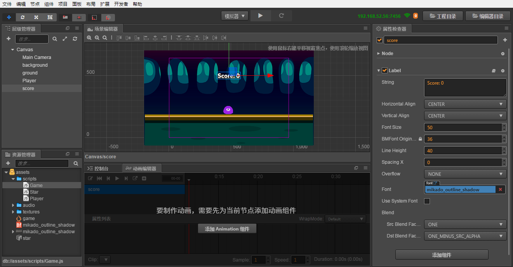

### 在 Game 脚本中添加得分逻辑

我们将会把计分和更新分数显示的逻辑放在 Game 脚本中。打开 Game 脚本，首先在 `properties` 区块中 **最后面** 添加分数显示 Label 的引用属性：

```js
// Game.js
    properties: {
        // ...
        // score label 的引用
        scoreDisplay: {
            default: null,
            type: cc.Label
        }
    },
```

接下来在 `onLoad` 方法中 **最后面** 添加用于记分的变量的初始化：

```js
// Game.js
    onLoad: function () {
        // ...
        // 初始化计分
        this.score = 0;
    },
```

然后在 `update` 方法的 **后面** 添加名为 `gainScore` 的新方法：

```js
// Game.js
    gainScore: function () {
        this.score += 1;
        // 更新 scoreDisplay Label 的文字
        this.scoreDisplay.string = 'Score: ' + this.score;
    },
```

保存 Game 脚本后，回到 **层级管理器**，选中 Canvas 节点，然后把前面添加好的 score 节点拖拽到 **属性检查器** 中 Game 组件的 `Score Display` 属性中。

### 调用得分逻辑

接下来我们需要在 Star 脚本中调用 Game 脚本中的得分逻辑。打开 Star 脚本，在 `onPicked` 方法中加入 `gainScore` 的调用：

```js
// Star.js
    onPicked: function() {
        // 当星星被收集时，调用 Game 脚本中的接口，生成一个新的星星
        this.game.spawnNewStar();

        // 调用 Game 脚本的得分方法
        this.game.gainScore();

        // 然后销毁当前星星节点
        this.node.destroy();
    },
```

保存脚本后必须回到编辑器，脚本的修改才会生效。然后点击预览，可以看到现在收集星星时屏幕正上方显示的分数会增加了！

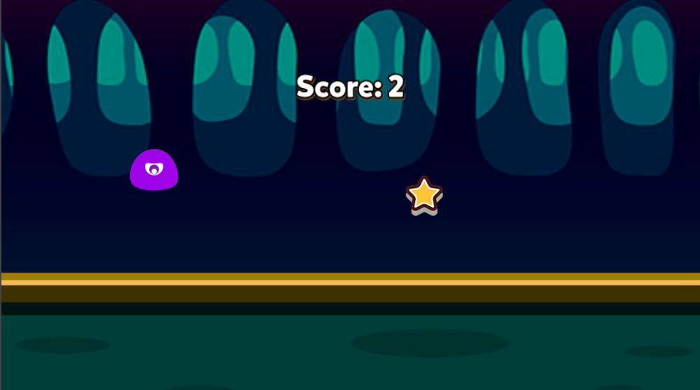

## 失败判定和重新开始

现在我们的游戏已经初具规模，但得分再多，不可能失败的游戏也不会给人成就感。接下来我们要加入星星定时消失的行为，而且让星星消失时就判定为游戏失败。也就是说，玩家需要在每颗星星消失之前完成收集，并不断重复这个过程完成玩法的循环。

### 添加星星计时消失的逻辑

打开 Game 脚本，在 `onLoad` 方法的 `spawnNewStar` 调用 **之前** 加入计时需要的变量声明：

```js
// Game.js
    onLoad: function () {
        // ...
        
        // 初始化计时器
        this.timer = 0;
        this.starDuration = 0;

        // 生成一个新的星星
        this.spawnNewStar();

        // 初始化计分
        this.score = 0;
    },
```

然后在 `spawnNewStar` 方法中 **最后面** 加入重置计时器的逻辑，其中 `this.minStarDuration` 和 `this.maxStarDuration` 是我们一开始声明的 Game 组件属性，用来规定星星消失时间的随机范围：

```js
// Game.js
    spawnNewStar: function() {
        // ...
        
        // 重置计时器，根据消失时间范围随机取一个值
        this.starDuration = this.minStarDuration + Math.random() * (this.maxStarDuration - this.minStarDuration);
        this.timer = 0;
    },
```

在 `update` 方法中加入计时器更新和判断是否超过时限的逻辑：

```js
// Game.js
    update: function (dt) {
        // 每帧更新计时器，超过限度还没有生成新的星星
        // 就会调用游戏失败逻辑
        if (this.timer > this.starDuration) {
            this.gameOver();
            return;
        }

        this.timer += dt;
    },
```

最后，在 `gainScore` 方法的后面加入 `gameOver` 方法，用于游戏失败时重新加载场景。

```js
// Game.js
    gameOver: function () {
        // 停止 Player 节点的跳跃动作
        this.player.stopAllActions(); 

        // 重新加载场景 game
        cc.director.loadScene('game');
    }
```

这里需要初学者了解的是，`cc.director` 是一个管理游戏逻辑流程的单例对象。由于 `cc.director` 是一个单例，所以您不需要调用任何构造函数或创建函数，使用它的标准方法是调用 `cc.director.methodName()`。例如这里的 `cc.director.loadScene('game')` 就是重新加载游戏场景 `game`，也就是游戏重新开始。而节点下的 `stopAllActions` 方法就显而易见了，这个方法会让节点上的所有 `Action` 都失效。

以上，对 Game 脚本的修改就完成了。保存 Game 脚本，然后打开 Star 脚本，我们需要为即将消失的星星加入简单的视觉提示效果，在 `update` 方法中 **最后面** 加入以下代码：

```js
// Star.js
    update: function() {
        // ...

        // 根据 Game 脚本中的计时器更新星星的透明度
        var opacityRatio = 1 - this.game.timer/this.game.starDuration;
        var minOpacity = 50;
        this.node.opacity = minOpacity + Math.floor(opacityRatio * (255 - minOpacity));
    }
```

保存 Star 脚本，我们的游戏玩法逻辑就全部完成了！然后回到编辑器，点击 **预览游戏** 按钮，我们在浏览器看到的就是一个有核心玩法、激励机制、失败机制的合格游戏了。

## 加入音效

尽管很多人玩手游的时候会无视声音，我们为了教程展示的工作流程尽量完整，还是要补全加入音效的任务。

### 跳跃音效

首先加入跳跃音效，打开 Player 脚本，在 `properties` 中添加引用声音文件资源的 `jumpAudio` 属性：

```js
// Player.js
    properties: {
        // ...
        
        // 跳跃音效资源
        jumpAudio: {
            default: null,
            type: cc.AudioClip
        },
    },
```

然后在 `runJumpAction` 方法中插入播放音效的回调，并通过添加 `playJumpSound` 方法来播放声音：

```js
// Player.js
    runJumpAction: function () {
        // 跳跃上升
        var jumpUp = cc.tween().by(this.jumpDuration, {y: this.jumpHeight}, {easing: 'sineOut'});

        // 下落
        var jumpDown = cc.tween().by(this.jumpDuration, {y: -this.jumpHeight}, {easing: 'sineIn'});

        // 创建一个缓动
        var tween = cc.tween()
                        // 按 jumpUp，jumpDown 的顺序执行动作
                        .sequence(jumpUp, jumpDown)
                        // 添加一个回调函数，在前面的动作都结束时调用我们定义的 playJumpSound() 方法
                        .call(this.playJumpSound, this);

        // 不断重复
        return cc.tween().repeatForever(tween);
    },

    playJumpSound: function () {
        // 调用声音引擎播放声音
        cc.audioEngine.playEffect(this.jumpAudio, false);
    },
```

### 得分音效

保存 Player 脚本以后打开 Game 脚本添加得分音效，首先仍然是在 `properties` 中添加一个属性来引用声音文件资源：

```js
// Game.js
    properties: {
        // ...
        
        // 得分音效资源
        scoreAudio: {
            default: null,
            type: cc.AudioClip
        }
    },
```

然后在 `gainScore` 方法中 **最后面** 添加播放声音的代码：

```js
// Game.js
    gainScore: function () {
        this.score += 1;
        // 更新 scoreDisplay Label 的文字
        this.scoreDisplay.string = 'Score: ' + this.score.toString();
        
        // 播放得分音效
        cc.audioEngine.playEffect(this.scoreAudio, false);
    },
```

保存脚本，回到 **层级管理器**，选中 Player 节点，从 **资源管理器** 中拖拽 `assets/audio/jump` 资源到 Player 组件的 `Jump Audio` 属性上。<br>
然后选中 Canvas 节点，将 `assets/audio/score` 资源拖拽到 Game 组件的 `Score Audio` 属性上。

这样就大功告成了！完成状态下的节点层级和各个关键组件的属性如下：

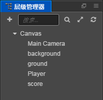

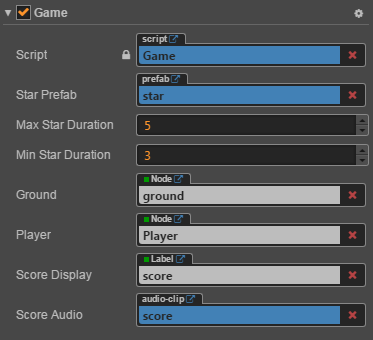

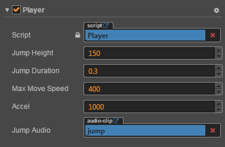

现在我们可以尽情享受刚制作完成的游戏了，您能打到多少分呢？别忘了您可以随时修改 Player 和 Game 组件里的移动控制和星星持续时间等游戏参数，来快速调节游戏的难度。修改组件属性之后需要保存场景，修改后的数值才会被记录下来。

## 总结

恭喜您完成了用 Cocos Creator 制作的第一个游戏！希望这篇快速入门教程能帮助您了解 Cocos Creator 游戏开发流程中的基本概念和工作流程。如果您对编写和学习脚本编程不感兴趣，也可以直接从完成版的项目中把写好的脚本复制过来使用。

接下来您还可以继续完善游戏的各方各面，以下是一些推荐的改进方向：

- 加入简单的开始菜单界面，在游戏运行的一开始显示开始按钮，点击按钮后才会开始游戏
- 为游戏失败加入简单的菜单界面，游戏失败后点击按钮才会重新开始
- 限制主角的移动不能超过视窗边界
- 为主角的跳跃动作加入更细腻的动画表现
- 为星星消失的状态加入计时进度条
- 收集星星时加入更华丽的效果
- 为触屏设备加入输入控制

以上这些方向都得到改善的游戏版本可以下载 **进化版项目 `polished_project`**（[GitHub](https://github.com/cocos-creator/tutorial-first-game/tree/v2.4) | [Gitee](https://gitee.com/mirrors_cocos-creator/tutorial-first-game/tree/v2.4)）来参考和学习，这里就不再赘述了。

此外如果希望将完成的游戏发布到服务器上分享给好友玩耍，可以阅读 [预览和构建](basics/preview-build.md) 一节的内容。

今天的教程就到这里了，您可以立刻开始制作您的第二款 Cocos Creator 游戏，或者继续阅读本手册。关于本快速开始教程的任何问题，都可以在 [GitHub 上的本教程仓库](https://github.com/cocos-creator/tutorial-first-game) 提交反馈。
