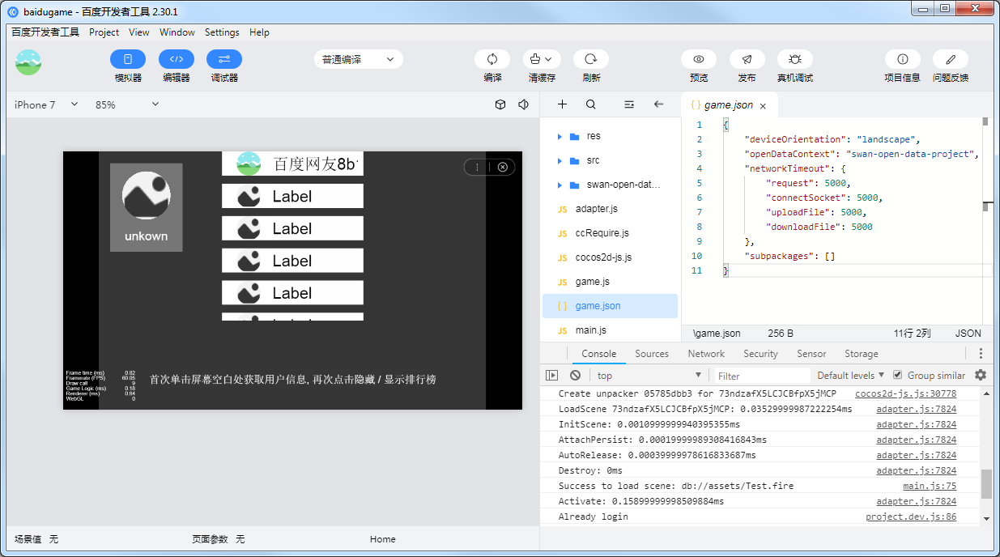

# 接入百度小游戏的开放数据域

类似微信小游戏，百度小游戏为了保护其社交关系链数据，也实现了一个 **开放数据域**，可以获取到同玩且双向关注的好友信息。这是一个单独的游戏执行环境。开放数据域中的资源、引擎、程序，都和主游戏完全隔离，开发者只有在开放数据域中才能访问百度小游戏提供的 `swan.getUserInfo()`、`swan.getUserCloudStorage()` 和 `swan.getFriendCloudStorage()` 这三个 API，用于获取相应的用户数据。由于开放数据域只能在离屏画布 sharedCanvas 上渲染，因此需要我们把 sharedCanvas 绘制到主域上。

由于开放数据域是一个封闭、独立的 JavaScript 作用域，所以开发者需要创建两个项目：

- 主域项目工程（正常的游戏项目）
- 开放数据域项目工程（通过百度 API 获取用户数据的项目）

在开放数据域项目工程中，独立通过开放数据域打包流程打包，并放置到主域工程的百度发布包中，就可以作为完整的百度小游戏工程在模拟器和真机上进行预览调试了。

百度开放数据域的具体使用方法，可参考 Cocos Creator 提供的 **开放数据域范例工程**（[GitHub](https://github.com/cocos/cocos-example-open-data-context) | [Gitee](https://gitee.com/mirrors_cocos-creator/OpenDataContext_TestCase)）。

## 主域项目工程

主域中创建一个节点作为开放数据域容器，添加 **SubContextView** 组件用于设置开放数据域视窗以及更新开放数据域贴图，这个节点的宽高比应该等于开放数据域设计分辨率的宽高比（否则会出现拉伸）。

**注意**：从 v2.4.1 开始，**SwanSubContextView** 已废弃，请使用 **SubContextView**。

## 开放数据域项目工程

创建开放数据域项目通过相关的 API 获取用户数据，根据自身需求制作 ui 的展示。整个开放数据域项目只应该包含其内容 UI，并且应该将场景中 Canvas 组件的设计分辨率设置为 UI 的完整分辨率，不需要对应主域的分辨率。

## SubContextView 技巧

这是开放数据域方案的核心组件，通过这个组件除了可以满足常规的需求，还有一些小技巧可以方便用户更好地控制开放数据域的表现。

- **视窗更新**

  一般情况下，开放数据域的视窗是固定的，但是也存在开放数据域在主域的视窗节点发生更新的情况，比如使用 Widget 去适配父节点，比如场景切换后设计分辨率发生改变的情况，或者是开发者手动调整了视窗的尺寸。这种情况下，开发者必须要调用 `updateSubContextViewport` 接口来更新开放数据域中的视窗参数，以便事件可以被正确映射到开放数据域视窗中

- **手动更新贴图**

  在 Creator v2.1.1 中，当开放数据域被唤起后，只要 **SubContextView** 组件 load 成功，开放数据域贴图就开始更新到主域并显示，之后每帧都会更新贴图。但是开放数据域贴图的更新有时可能损耗比较高，开发者设计的开放数据域又是静态界面（比如翻页式的界面），此时就不需要每帧更新贴图，可以尝试通过禁用组件来阻止每帧更新逻辑，并通过手动调用 update 函数来在需要的时候更新：

  ```js
  subContextView.enabled = false;
  subContextView.update();
  ```

  这样手动控制是性能最优的方案。如需开启自动更新贴图，则启用 **SubContextView** 组件后，开放数据域的主循环会恢复执行。

- **设置贴图更新频率**

  在 Creator v2.1.1 中，**SubContextView** 组件上新增了 **FPS 属性**，用户可以通过设置 FPS 直接控制开放数据域的帧率。

  

  FPS 属性有以下两方面的优点：

  - 主域会根据设置的 FPS 计算出一个 update interval，这个 interval 可以防止引擎频繁调用 update 更新开放数据域的 canvas 贴图。
  - 通过降低开放数据域的 FPS，也可以一定程度上减少开放数据域的性能开销。

  **注意：FPS 属性会覆盖开放数据域的 `cc.game.setFrameRate()` 实现，所以建议直接在主域项目中设置好 SubContextView 组件的 FPS 属性。**

- **控制开放数据域中的引擎主循环**

  在 Creator **v2.4.3**，我们完善了开放数据域中对引擎主循环的控制，默认情况下不运行。只有在 SubContextView 组件启用后才会运行引擎主循环，SubContextView 组件禁用时则停止运行。

  当 SubContextView 组件未启用时，引擎主循环不会运行，因此项目中写在组件生命周期中的业务逻辑也不会执行。所以在还未启用 SubContextView 组件时，部分需要提前执行的相关业务逻辑请写在组件外部或者插件脚本中。

  这里需要注意的是有一个特例，由于开放数据域会默认加载首场景，所以首场景中默认激活的组件会执行 `onLoad` 回调。例如：

  ```js
  console.log("do some stuff before enabling SubContextView component");

  cc.Class({
      extends: cc.Component,

      onLoad () {
          console.log("execute if it's enabled in the start scene");
      },

      start () {
          console.log("won't execute before enabling SubContextView component");
      },
  });
  ```

  另外，在开放数据域项目中，如果需要监听来自主域的消息，则需要先判断消息是否来自主域引擎：

  ```js
  swan.onMessage(res => {
      if (!(res && res.fromEngine)) {
          console.log('do something...');
      }
  });
  ```

## 开放数据域发布流程

### 模块选择

由于百度开放数据域的代码和资源都无法与主域共享，所以对包体很敏感，开发者需要对开放数据域工程专门设置 [项目模块剔除选项](../getting-started/basics/editor-panels/project-settings.md)。

需要注意的是，开发者在开放数据域项目中不能剔除 **项目设置 -> 模块设置** 面板中的 **Canvas Renderer** 模块，因为开放数据域仅支持 Canvas 渲染。同时，Canvas 渲染下所支持的渲染组件也是受限的（UI 组件不受限制），目前仅支持：

- Sprite
- Label
- Graphics
- Mask

### 发布步骤

一、打开主域项目，在 **菜单栏 -> 项目** 中打开 **构建发布** 面板，选择 **百度小游戏**，填入 **开放数据域代码目录**。该目录是开放数据域构建后所在的路径，并且这个路径需要放在主域构建目录下。然后点击 **构建**。


该步骤会帮用户自动配置到主域项目 `build -> baidugame -> game.json` 中，用于辨别开放数据域文件在主域发布包下的所在目录。


二、打开开放数据域项目，点击 **菜单栏 -> 构建发布** 来打开 **构建发布** 面板，然后在 **发布平台** 中选择 **百度小游戏开放数据域**。

三、**发布路径** 设置为主域中填入的 **开放数据域代码目录** 相同路径，即指定到主域项目工程的发布包目录下。然后点击 **构建**。

> **注意**：**游戏名称** 必须和主域项目中设置的 **开放数据域代码目录** 名称一致。


或者可以不修改 **发布路径**，在开放数据域项目构建完成后手动将发布包拷贝到主域项目的发布包目录下。如下图所示：


四、用百度开发者工具打开构建出来的主域项目，即可按照之前百度小游戏的正常流程进行发布和调试。



## 参考链接

- **Cocos Creator 小游戏开放数据域范例工程**（[GitHub](https://github.com/cocos/cocos-example-open-data-context) | [Gitee](https://gitee.com/mirrors_cocos-creator/OpenDataContext_TestCase)）
- [百度官方文档：关系链数据使用指南](https://smartprogram.baidu.com/docs/game/tutorials/open_api/guide/#%E5%BC%80%E6%94%BE%E6%95%B0%E6%8D%AE%E5%9F%9F)
