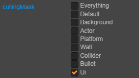
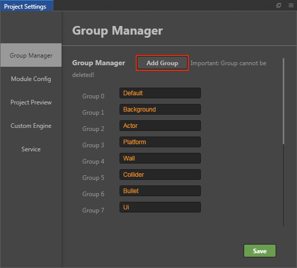
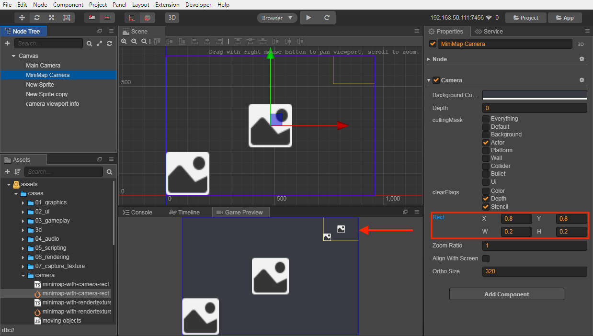

# Camera 摄像机

摄像机是玩家观察游戏世界的窗口，场景中至少需要有一个摄像机，也可以同时存在多个摄像机。创建场景时，Creator 会默认创建一个名为 `Main Camera` 的摄像机，作为这个场景的主摄像机。多摄像机的支持可以让你轻松实现高级的自定义效果，比如双人分屏效果，或者场景小地图的生成。


## 摄像机属性

- **backgroundColor**

  当指定了摄像机需要清除颜色的时候，摄像机会使用设定的背景色来清除场景。

- **depth**

  摄像机深度，用于决定摄像机的渲染顺序。值越大，则摄像机越晚被渲染。

- **cullingMask**

  `cullingMask` 将决定这个摄像机用来渲染场景的哪些部分。在 **属性检查器** 中的摄像机组件中的 `cullingMask` 会列出当前可以选择的 mask 选项，你可以通过勾选这些选项来组合生成 `cullingMask`。

  例如下图中的 `cullingMask` 设置表示这个摄像机只用来渲染游戏中的 UI 部分，一般游戏中的 UI 部分都是不需要移动的，而游戏节点可能会往屏幕外移动，这时需要另外的一个摄像机去跟随这个游戏节点。

  

  用户可以通过编辑器菜单栏中的 **项目 -> 项目设置 -> 分组管理** 来添加或者更改分组，这些分组即是对应的 mask。

  

- **clearFlags**

  指定渲染摄像机时需要做的清除操作。

  

- **rect**

  决定摄像机绘制在屏幕上的哪个区域，便于实现类似小地图那样的 Viewport，值为 0～1。

  

  如上图所示，场景中创建了一个用来显示小地图的 camera，最终显示效果在 **游戏预览** 窗口的右上角可以看到。

- **zoomRatio**

  指定摄像机的缩放比例，值越大显示的图像越大。

- **alignWithScreen**

  当 alignWithScreen 为 true 的时候，摄像机会自动将视窗大小调整为整个屏幕的大小。如果想要完全自由地控制摄像机，则需要将 alignWithScreen 设置为 false。（v2.2.1 新增）

- **orthoSize**

  摄像机在正交投影模式下的视窗大小。该属性在 alignWithScreen 设置为 **false** 时生效。

- **targetTexture**

  如果设置了 `targetTexture`，那么摄像机渲染的内容不会输出到屏幕上，而是会渲染到 `targetTexture` 上。

  如果你需要做一些屏幕的后期特效，可以先将屏幕渲染到 `targetTexture`，然后再对 `targetTexture` 做整体处理，最后再通过一个 `sprite` 将这个 `targetTexture` 显示出来。

### 3D 摄像机属性

这些属性在摄像机节点设置为 [3D 节点](../3d/3d-node.md) 后才会显示在 **属性检查器** 中。

- **nearClip**

  摄像机的近剪裁面。

- **farClip**

  摄像机的远剪裁面。

- **ortho**

  设置摄像机的投影模式是正交（true）还是透视（false）模式。

- **fov**

  决定摄像机视角的高度，当 **alignWithScreen** 和 **ortho** 都设置为 **false** 时生效。

如需调节在 **场景编辑器** 中所用的摄像机参数，可参考 [场景摄像机配置面板](../content-workflow/camera-config.md)。

## 摄像机方法

- **cc.Camera.findCamera**

  `findCamera` 会通过查找当前所有摄像机的 `cullingMask` 是否包含节点的 `group` 来获取第一个匹配的摄像机。

  ```javascript
  cc.Camera.findCamera(node);
  ```

- **containsNode**

  检测节点是否被此摄像机影响。

- **render**

  如果你需要立即渲染摄像机，可以调用这个方法来手动渲染摄像机，比如截图的时候。

  ```javascript
  camera.render();
  ```

### 坐标转换

一个常见的问题是，当摄像机被移动、旋转或者缩放后，这时候用点击事件获取到的坐标去测试节点的坐标，这样往往是获取不到正确结果的。

因为这时候获取到的点击坐标是屏幕坐标系下的坐标了，我们需要将这个坐标转换到世界坐标系下，才能继续与节点的世界坐标进行运算。

下面是一些坐标系转换的函数

```javascript
// 将一个屏幕坐标系下的点转换到世界坐标系下
camera.getScreenToWorldPoint(point, out);
// 将一个世界坐标系下的点转换到屏幕坐标系下
camera.getWorldToScreenPoint(point, out);

// 获取屏幕坐标系到世界坐标系的矩阵，只适用于 2D 摄像机并且 alignWithScreen 为 true 的情况
camera.getScreenToWorldMatrix2D(out);
// 获取世界坐标系到屏幕坐标系的矩阵，只适用于 2D 摄像机并且 alignWithScreen 为 true 的情况
camera.getWorldToScreenMatrix2D(out);
```

## 截图

截图是游戏中一个非常常见的需求，通过摄像机和 RenderTexture 我们可以快速实现一个截图功能。对于截图功能，在 example-cases 中有完整的测试例，代码示例可参考 **07_capture_texture**（[GitHub](https://github.com/cocos/example-projects/tree/v2.4.3/assets/cases/07_capture_texture) | [Gitee](https://gitee.com/mirrors_cocos-creator/example-cases/tree/v2.4.3/assets/cases/07_capture_texture)）范例。

### 截取部分区域

当摄像机设置了 RenderTexture 并且 **alignWithScreen** 为 **true** 的时候，camera 视窗大小会调整为 **design resolution** 的大小。如果只需要截取屏幕中的某一块区域时，设置 **alignWithScreen** 为 **false**，并且根据摄像机的 **投影方式** 调整 **orthoSize** 或者 **fov** 即可。

详情可参考 example-cases 中的测试例：

- **minimap-with-camera-rect**：[GitHub](https://github.com/cocos/example-projects/blob/v2.4.3/assets/cases/camera/minimap-with-camera-rect.ts) | [Gitee](https://gitee.com/mirrors_cocos-creator/example-cases/blob/v2.4.3/assets/cases/camera/minimap-with-camera-rect.ts)
- **minimap-with-rendertexture**：[GitHub](https://github.com/cocos/example-projects/blob/v2.4.3/assets/cases/camera/minimap-with-rendertexture.ts) | [Gitee](https://gitee.com/mirrors_cocos-creator/example-cases/blob/v2.4.3/assets/cases/camera/minimap-with-rendertexture.ts)

### 在原生平台上保存截图文件

首先先截图，然后在 `readPixels` 之后使用：

```js
var data = renderTexture.readPixels();
var filePath = jsb.fileUtils.getWritablePath() + 'Image.png';
jsb.saveImageData(data, imgWidth, imgHeight, filePath)
```

详情请参考 example-case 中的 **capture_to_native**（[GitHub](https://github.com/cocos/example-projects/tree/v2.4.3/assets/cases/07_capture_texture/capture_to_native.js) | [Gitee](https://gitee.com/mirrors_cocos-creator/example-cases/blob/v2.4.3/assets/cases/07_capture_texture/capture_to_native.js)）范例。

### 微信中的截图

微信小游戏中由于不支持 `createImageData`，也不支持用 data url 创建 image，所以上面的做法需要一些变通。在使用 Camera 渲染出需要的结果后，请使用微信的截图 API [canvas.toTempFilePath](https://developers.weixin.qq.com/minigame/dev/api/render/canvas/Canvas.toTempFilePath.html) 完成截图的保存和使用。

## 案例

具体可以参考 **范例**（[GitHub](https://github.com/cocos/example-projects/tree/v2.4.3/assets/cases/07_capture_texture) | [Gitee](https://gitee.com/mirrors_cocos-creator/example-cases/tree/v2.4.3/assets/cases/07_capture_texture)），从编辑器创建范例集合项目可以看到实际运行效果。
