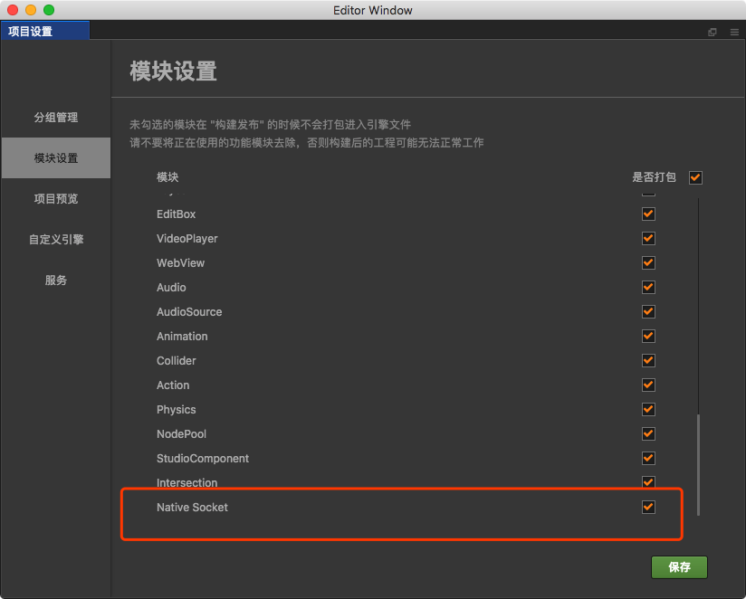

# 标准网络接口

在 Cocos Creator 中，我们支持 Web 平台上最广泛使用的标准网络接口：

- **XMLHttpRequest**：用于短连接
- **WebSocket**：用于长连接

当然，在 Web 平台，浏览器原生就支持这两个接口，之所以说 Cocos Creator 支持，是因为在发布原生版本时，用户使用这两个网络接口的代码也是可以运行的。也就是遵循 Cocos 一直秉承的 “一套代码，多平台运行” 原则。

> **注意**：如果需要在原生平台使用 `WebSocket`，请确保有在 **项目 -> 项目设置 -> 模块设置** 中勾选了 **Native Socket** 模块。

## 使用方法

1. XMLHttpRequest

    简单示例：

    ```js
    let xhr = new XMLHttpRequest();
    xhr.onreadystatechange = function () {
        if (xhr.readyState == 4 && (xhr.status >= 200 && xhr.status < 400)) {
            var response = xhr.responseText;
            console.log(response);
        }
    };
    xhr.open("GET", url, true);
    xhr.send();
    ```

    开发者可以直接使用 `new XMLHttpRequest()` 来创建一个连接对象。

    `XMLHttpRequest` 的标准文档请参考 [MDN 中文文档](https://developer.mozilla.org/zh-CN/docs/Web/API/XMLHttpRequest)。

2. WebSocket

    简单示例：

    ```js
    let ws = new WebSocket("ws://echo.websocket.org");
    ws.onopen = function (event) {
        console.log("Send Text WS was opened.");
    };
    ws.onmessage = function (event) {
        console.log("response text msg: " + event.data);
    };
    ws.onerror = function (event) {
        console.log("Send Text fired an error");
    };
    ws.onclose = function (event) {
        console.log("WebSocket instance closed.");
    };

    setTimeout(function () {
        if (ws.readyState === WebSocket.OPEN) {
            ws.send("Hello WebSocket, I'm a text message.");
        }
        else {
            console.log("WebSocket instance wasn't ready...");
        }
    }, 3);
    ```

    `WebSocket` 的标准文档请参考文档 [MDN](https://developer.mozilla.org/zh-CN/docs/Web/API/WebSocket)。

## SocketIO

> 很抱歉，Creator 并未在 Web 平台上提供 socket.io 的官方支持，需要用户自己在项目中添加，并且原生平台的 socket.io 也已废弃。之前原生平台的 socket.io 是第三方开发者自己实现的，已经很久没有维护了，所以也不推荐使用。

除此之外，SocketIO 提供一种基于 WebSocket API 的封装，可以用于 Node.js 服务端。如果需要使用这个库，开发者可以自己引用 SocketIO。

在脚本中引用 SocketIO：

1. 下载 SocketIO：[https://socket.io](https://socket.io)。

2. 将下载后的文件放入拖入资源管理器中你希望保存的路径。

3. 修改 SocketIO 脚本文件以避免在原生环境中被执行。

    由于 Web 版本 SocketIO 不能够在 JSB 中被正确解析，因此 Cocos 在原生环境中自带了 SocketIO 实现。所以我们需要一点 hack 的手段让 Web 版本 SocketIO 的脚本在原生环境中不生效，方法就是在 SocketIO 脚本文件中做如下修改：

    ```js
    if (!cc.sys.isNative) {
        // SocketIO 原始代码
    }
    ```

4. 将 SocketIO 脚本文件设为 [插件脚本](./plugin-scripts.html)，这样在组件中直接使用 window.io 就能访问到 SocketIO。

5. 在组件中使用 SocketIO，可以参考 [SocketIO 官方网站](http://socket.io/) 查询 API 和文档等。

> **注意**：如果你需要在原生使用 `WebSocket` 或 `SocketIO` 请确保你勾选了 `Native Socket` 模块：
>
> 
