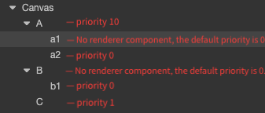

# Rendering Order

## 2D rendering node ordering

2D rendering nodes can be divided into nodes under Canvas and nodes that are not under Canvas:

- The nodes under Canvas can be found in **UI node ordering** below.

- The nodes that are not under Canvas, the user can choose to enable depth detection and occlusion display of 3D objects through [custom materials](ui-material.md), which will render the occlusion according to the Z-axis coordinates of the object when enabled (see example [2d-rendering-in-3d](https://github.com/cocos/cocos-test-projects/tree/v3.0/assets/cases/2d-rendering-in-3d)). If depth detection is disabled, the data will still be submitted in the order of the node tree, which means that nodes further down the node tree will be rendered later.

## UI node ordering

The rendering order of the UI uses the **Breadth-First Sorting** scheme, and each UITransform component has a `priority` property. Adjust the order of nodes according to the value of priority.

Sorting starts from the child nodes under the root node, and determines the overall rendering structure according to the priority of the child nodes, that is, the rendering order of the child nodes under the root node has determined the final rendering order. The `priority` property of all child nodes under each node is used to determine the rendering order under the current node.

For example:

Therefore, the overall rendering order in the figure above is **B -> b1 -> C -> A -> a1 -> a2**, and the rendering state on the screen is **a2 -> a1 -> A -> C -> b1 -> B**.

## Detailed Explanation

**Sorting** is a very simple function, but the final rendering is based on the rendering capabilities provided by different platforms.  
Therefore, explain here. If you encounter an error in **UI rendering**, such as flickering or unwanted artifacts or other please consider the following. The first thing to check is the **ClearFlag** of all cameras (**Camera** and **Canvas**) in the scene, and make sure that the lowest **Canvas** or **Camera**'s **ClearFlag** property is set to **SOLID_COLOR** in each scene.

To set the **ClearFlag** property, please refer to the following situations:

- If there is only one **UI Canvas** or **3D Camera** in the scene, then the **ClearFlag** property is set to `Solid_Color`.
- If the scene contains 2D background layer, 3D scene layer, 2D UI layer, then:
    - **2D background layer**: **ClearFlag** property is set to `Solid_Color`.
    - **3D scene layer**: **ClearFlag** property is set to `Depth_Only`.
    - **2D UI layer**: If the model is included, the **ClearFlag** property is set to `Depth_Only` to avoid a model splash screen. If no model is present, the **ClearFlag** property can be set to `Dont_Clear`/`Depth_Only`.

  
