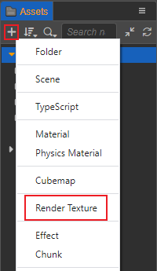

# 渲染纹理资源（RenderTexture）

渲染纹理是一张在 GPU 上的纹理。通常我们会把它设置到相机的 **目标纹理** 上，使相机照射的内容通过离屏的 `frambuffer` 绘制到该纹理上。一般可用于制作汽车后视镜，动态阴影等功能。

## 创建 RenderTexture

在 **资源管理器** 中点击左上方的 **+** 按钮，选择 **渲染纹理**，即可创建渲染纹理资源：



然后在 **属性检查器** 中便可以设置渲染纹理资源的相关属性：


| 属性 | 说明 |
| :--- | :--- |
| **Width** | 设置渲染纹理的宽 |
| **Height** | 设置渲染纹理的高 |

## 使用 RenderTexture

方法一：将 3D 相机可见范围内的内容绘制到 UI 的精灵帧上

```typescript
export class CaptureToWeb extends Component {
    @property(Sprite)
    sprite: Sprite = null;
    @property(Camera)
    camera: Camera = null;

    protected _renderTex: RenderTexture = null;

    start () {
        const spriteframe = this.sprite.spriteFrame;
        const sp = new SpriteFrame();
        sp.reset({
            originalSize: spriteframe.getOriginalSize(),
            rect: spriteframe.getRect(),
            offset: spriteframe.getOffset(),
            isRotate: spriteframe.isRotated(),
            borderTop: spriteframe.insetTop,
            borderLeft: spriteframe.insetLeft,
            borderBottom: spriteframe.insetBottom,
            borderRight: spriteframe.insetRight,
        });

        const renderTex = this._renderTex = new RenderTexture();
        renderTex.reset({
            width: 256,
            height: 256,
            colorFormat: RenderTexture.PixelFormat.RGBA8888,
            depthStencilFormat: RenderTexture.DepthStencilFormat.DEPTH_24_STENCIL_8
        });
        this.camera.targetTexture = renderTex;
        sp.texture = renderTex;
        this.sprite.spriteFrame = sp;
    }
}
```

方法二：将 3D 相机可见范围内的内容绘制到 3D 模型上

```ts
export class RenderCameraToModel extends Component {
    @property(MeshRenderer)
    model: MeshRenderer = null;

    start () {
        // Your initialization goes here.
        const renderTex = new RenderTexture();
        renderTex.reset({
            width: 256,
            height: 256,
            colorFormat: RenderTexture.PixelFormat.RGBA8888,
            depthStencilFormat: RenderTexture.DepthStencilFormat.DEPTH_24_STENCIL_8,
        });
        const cameraComp = this.getComponent(Camera);
        cameraComp.targetTexture = renderTex;
        const pass = this.model.material.passes[0];
        const binding = pass.getBinding('mainTexture');
        pass.bindTextureView(binding, renderTex.getGFXTextureView());
    }
}
```

更多方法请参考范例 **RenderTexture**（[GitHub](https://github.com/cocos/cocos-test-projects/tree/v3.0/assets/cases/rendertexture) | [Gitee](https://gitee.com/mirrors_cocos-creator/test-cases-3d/tree/v3.0/assets/cases/rendertexture)）。
