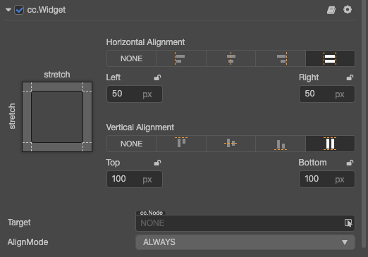
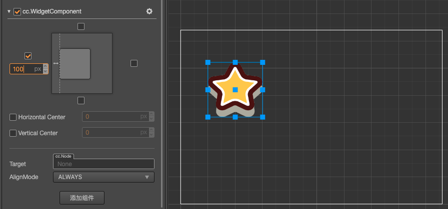
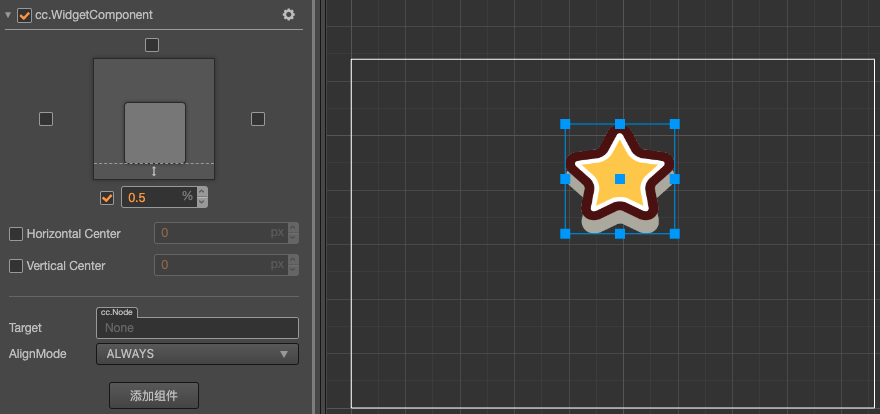
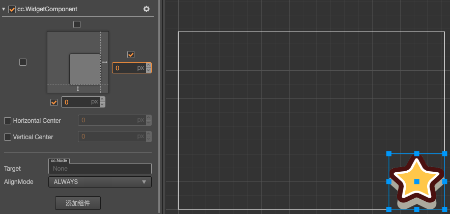
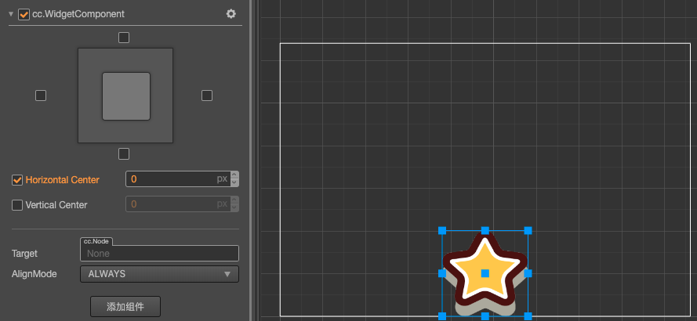
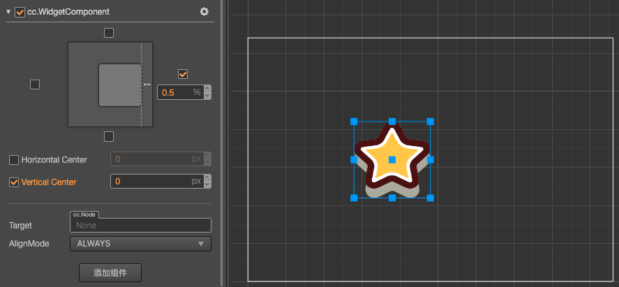
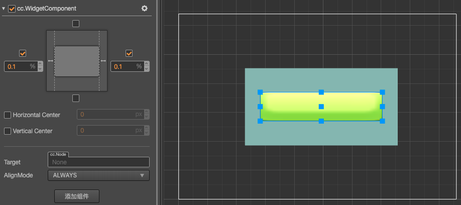
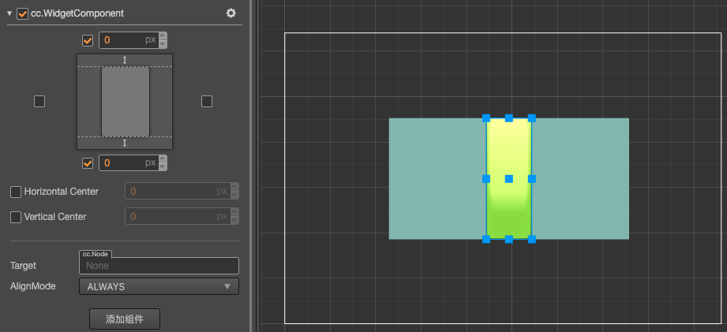
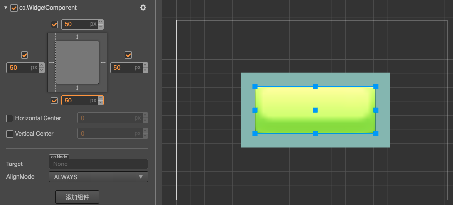

# Widget 组件参考

Widget (对齐挂件) 是一个很常用的 UI 布局组件。它能使当前节点自动对齐到父物体的任意位置，或者约束尺寸，让你的游戏可以方便地适配不同的分辨率。对齐方案详细说明请参考 [对齐方案](../engine/widget-align.md)



点击 **属性检查器** 下面的 **添加组件** 按钮，然后选择 **UI/Widget** 即可添加 Widget 组件到节点上。

对齐挂件的脚本接口请参考 [Widget API](__APIDOC__/zh/classes/ui.widget.html)。

关于使用可以参考范例 **Widget**（[GitHub](https://github.com/cocos/cocos-test-projects/tree/v3.0/assets/cases/ui/04.widget) | [Gitee](https://gitee.com/mirrors_cocos-creator/test-cases-3d/tree/v3.0/assets/cases/ui/04.widget)）。

## 选项

选项     | 说明      | 备注
:--     | :--      | :--
Top     | 对齐上边界 | 选中后，将在旁边显示一个输入框，用于设定当前节点的上边界和父物体的上边界之间的距离。
Bottom  | 对齐下边界 | 选中后，将在旁边显示一个输入框，用于设定当前节点的下边界和父物体的下边界之间的距离。
Left    | 对齐左边界 | 选中后，将在旁边显示一个输入框，用于设定当前节点的左边界和父物体的左边界之间的距离。
Right   | 对齐右边界 | 选中后，将在旁边显示一个输入框，用于设定当前节点的右边界和父物体的右边界之间的距离。
HorizontalCenter   | 水平方向居中 |
VerticalCenter     | 竖直方向居中 |
Target  | 对齐目标   | 指定对齐参照的节点，当这里未指定目标时会使用直接父级节点作为对齐目标
AlignMode | 指定 Widget 的对齐方式，用于决定运行时 Widget 应何时更新 | 通常设置为 **ALWAYS**，每次节点产生变动时重新对齐。<br>设置为 **ONCE** 时，仅在组件初始化时进行一次对齐。**ON_WINDOW_RESIZE** 时会在每次窗口变动时候更新一次|

## 对齐边界

我们可以在 Canvas 下新建一个 sprite，在 sprite 节点上添加一个 Widget 组件，然后做如下一些测试：

### 左对齐，左边界距离 100 px



### 下对齐，下边界距离 50%

百分比将以父节点的宽或高作为基准。



### 右下对齐，边界距离 0 px



## 居中对齐

### 水平方向居中



### 竖直方向居中，并且右边界距离 50%



## 约束尺寸

如果左右同时对齐，或者上下同时对齐，那么在相应方向上的尺寸就会被拉伸。
下面演示一下，在场景中放置两个矩形 Sprite，大的作为对话框背景，小的作为对话框上的按钮。按钮节点作为对话框的子节点，并且按钮设置成 Sliced 模式以便展示拉伸效果。

### 宽度拉伸，左右边距 10%



### 高度拉伸，上下边距 0，同时水平居中



### 水平和竖直同时拉伸，边距 50 px



## 对节点位置、尺寸的限制

如果 **Align Mode** 属性设为 **ALWAYS** 时，会在运行时每帧都按照设置的对齐策略进行对齐，组件所在节点的位置（position）和尺寸（width，height）属性可能会被限制，不能通过 API 或动画系统自由修改。这是因为通过 Widget 对齐是在每帧的最后阶段进行处理的，因此对 Widget 组件中已经设置了对齐的相关属性进行设置，最后都会被 Widget 组件本身的更新所重置。

如果需要同时满足对齐策略和可以在运行时改变位置和尺寸的需要，可以通过以下两种方式实现：

1. 确保 **Widget** 组件的 **Align Mode** 属性设置为 **ONCE**，该属性只会负责在组件初始化（onEnable）时进行一次对齐，而不会每帧再进行一次对齐。可以在初始化时自动完成对齐，然后就可以通过 API 或动画系统对 UI 进行移动变换了。
2. 通过调用 **Widget** 组件的对齐边距 API，包括 **top**、 **bottom**、 **left**、 **right**，直接修改 Widget 所在节点的位置或某一轴向的拉伸。这些属性也可以在动画编辑器中添加相应关键帧，保证对齐的同时实现各种丰富的 UI 动画。

### 通过脚本代码修改对齐距离

```ts
import { _decorator, Component, Widget } from 'cc';
const { ccclass, property } = _decorator;

@ccclass('Example')
export class Example extends Component {
    start () {
        const widget = this.getComponent(Widget);
        // 设置默认对齐单位是 px
        widget!.bottom = 50;
        widget!.top = 50;

        // 设置对齐单位是 %
        widget!.isAbsoluteTop = false;
        widget!.isAbsoluteBottom = false;
        widget!.bottom = 0.1; // 10%
        widget!.top = 0.1; // 10%
    }
}
```
