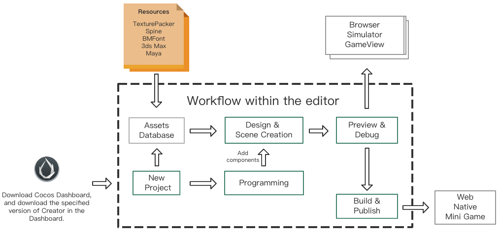
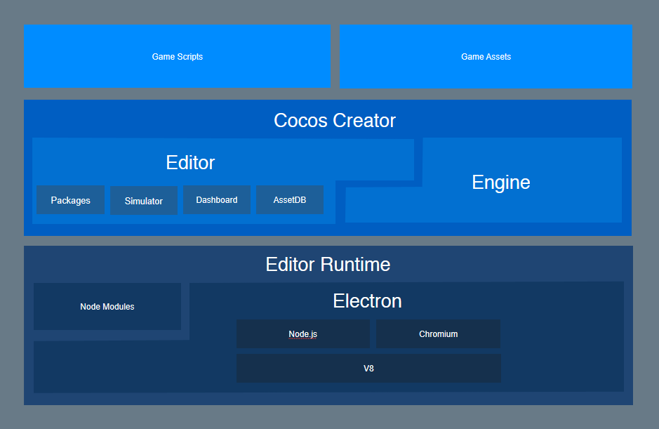
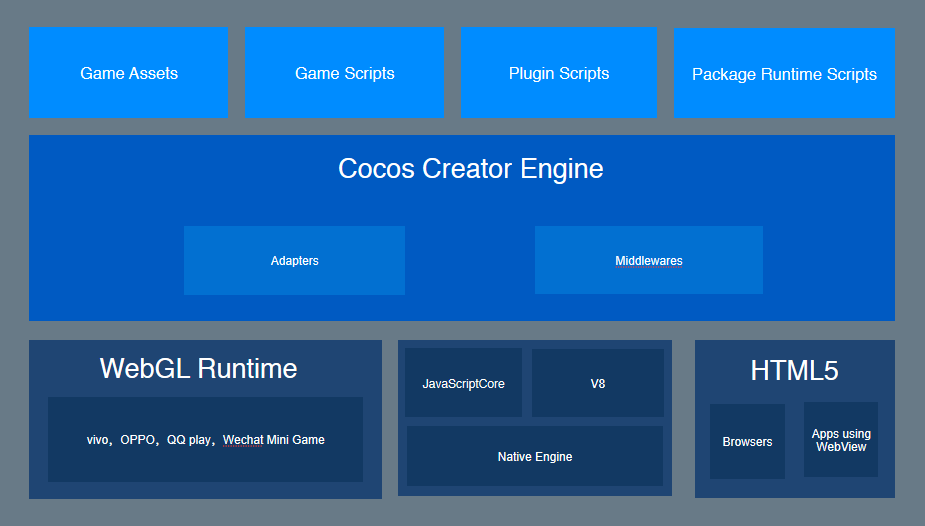

# About Cocos Creator

- **Q**: Is Cocos Creator a game engine? 
  **A**: It's a complete game development solution that includes a lightweight and efficient cross-platform game engine, and various UI tools that can help you develop games more quickly.

- **Q**: What is the editor of Cocos Creator? 
  **A**: It is an all-in-one, extensible editor that simplifies resource management, game debugging and previewing, and multi-platform publishing. Support for Windows and Mac systems.

- **Q**: I can't write programs, can I use Cocos Creator? 
  **A**: Of course! The Cocos Creator editor provides two workflows for design and development, allows designers to deeply participate in the game development process, making quick edits and iterations during the game development cycle, providing a simple and smooth way of working together.

- **Q**: What platform can Cocos Creator let me develop for? 
  **A**: Cocos Creator supports all major platforms allowing games to be quickly released for the web, iOS, Android, Windows, Mac, and various mini-game platforms. A pure JavaScript-developed engine runtime is available on the web and mini-game platforms for better performance and smaller packages. On other native platforms, C++ is used to implement the underlying framework, providing greater operational efficiency.

## What is Cocos Creator?

Cocos Creator is a content creation-focused, scripted, component-based and data-driven game development tool. It features an easy-to-use content production workflow and a powerful developer tool suite for implementing game logic and high-performance game effects.

## Workflow Description

In the development stage, Cocos Creator has been able to bring great efficiency and creativity to users, but the workflow we offer goes far beyond the development. For a successful game, the entire workflow of development and debugging, commercial SDK integration, multi-platform release, testing, and launching is not only indispensable, but iterates through multiple iterations.

Cocos Creator integrates the entire mobile browser game solution into the editor tool, eliminating the need to shuttle between multiple software applications. With the Cocos Creator editor open, a one-click automated process takes the least amount of time and effort to solve all the above questions. Developers can focus on the development phase and increase product competitiveness and creativity!

### Creating or importing resources

You can complete resource importing by dragging and dropping resources such as images, sounds, etc. into the editor's **Assets** panel.

In addition, you can create scenes, prefabs, animations, scripts, particles and other resources directly within the editor.

### Building scene

After having some basic resources in the project, we can start to set up the scene. The scene is the most basic organization of the game content, and it is also the basic form of showing the game to the player.

### Adding component scripts to implement interactive functions

We can mount various built-in components and custom script components for the nodes in the scene to enable the game logic to run and interact. This includes from the most basic animation playback and button responses, to the main loop script that drives the entire game logic and the control of the player's character. Almost all game logic functions are implemented by mounting scripts to nodes in the scene.

### One-click preview and release

In the process of setting up the scene and developing functions, you can click to preview your work, at any time, to see the current scene running. Use your phone to scan the QR code and instantly preview the game on your phone. When the development comes to an end, the **Build** panel allows you to publish games to multiple platforms, including desktops, mobile phones, and the Web.

## Features

Highlights of Cocos Creator's features include:

- Data properties can be adjusted at any time in the editor and can be easily declared in scripts. Designers can even adjust parameters without interfering with code.
- UI system that support smart canvas adaptation and programming-free element alignment are perfectly adapted to device screens of any resolution.
- An animation system that supports animated track preview and complex curve editing.
- Scripting development using dynamic language support, you can use JavaScript to develop games, quickly preview and debug on physical machines and devices, and update your published games. TypeScript is also supported and can be mixed with your JavaScript code at the same time.
- The underlying layer evolved from Cocos2d-x, and maintain lightweight and high performance of native level while enjoying the convenience of scripted development
- Script componentization and an open plugin system provide developers with methods to customize workflows at different depths. The editor can be adjusted on a large scale to fit the needs of different teams and projects.
- It comes with an easy-to-follow content production workflow and a powerful suite of developer tools for high-performance game creation.

## Framework Structure

Cocos Creator includes the full set of features required for game development such as the game engine, resource management, scene editing, game preview, game publishing, and integrates all functions and toolchain into one unified application.

While providing a powerful and complete toolchain, the editor provides an open plug-in architecture that allows developers to easily extend the editor's functionality and allows customizations to personalize workflows using front-end common technologies such as HTML + JavaScript.

Below is the technical architecture diagram of Cocos Creator

Figure 1

Figure 2

As you can see from the figure, the editor is a development environment built on top of the Electron framework. The engine is responsible for providing many easy-to-use components and a unified interface for each platform.

The combination of the engine and the editor brings the data-driven and componentized approach to functional development, as well as the perfect division of labor between the design and the program:

- Designers build the visual presentation of game scenes in the editor
- Programmers develop functional components that can be mounted to any object in the scene
- The designer is responsible for mounting the components for objects that need to exhibit specific behavior and improving the parameters through debugging
- The data structures and resources that programmers need to develop games
- Designers configure various data and resources through a graphical interface
- (From simple to complex, all kinds of workflows you can imagine can be implemented)

Workflow-centric development concepts allow developers of different functions to quickly find work entry points that maximize their role, and fluently coordinate with other team members.

## Instructions for use

On the basis of data-driven workflow, the creation and editing of the scene becomes the focus of game development. The design work and functional development can be synchronized for seamless collaboration. Whether you're an artist, a designer, or a programmer, you can all click the **Preview** button at any point in the production process to test the latest state of the game in browser, mobile device simulators or physical device.

Programmers and designers can now implement a wide range of division of labor, whether it is to build the scene first, then add functions, or to first produce functional modules and then combined debugging by designers, Cocos Creator can meet the needs of the development team. The properties defined in the script can be presented in the editor with the most appropriate visual experience to facilitate the content producer.

Content resources outside the scene can be imported from outside, such as images, sounds, atlases, skeletal animations, etc. In addition, we are constantly improving the editor's production resources, including the currently completed animation editor, art people can use this tool to create very delicate and expressive animation resources, and can see the preview of the animation in the scene at any time.

Supports both 2D and 3D game development with features that meet the specific needs of your various game types. Deep optimization of the editor experience and engine performance, and built-in support for middleware such as Spine, DragonBones, TiledMap, Box2D, and Texture Packer.

Finally, the developed game can be published to each platform by one-click through a graphical tool, from design development to test release, Cocos Creator can handle everything for you.
