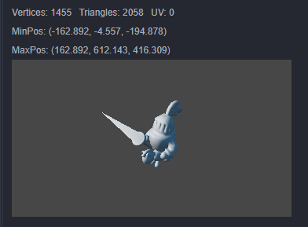

# Model assets

Currently, Creator supports model files in __FBX__ and __glTF__ formats.

- FBX: FBX 2020 and earlier file formats are supported.
- glTF: glTF 2.0 and earlier file formats are supported, please refer to the [glTF models](./glTF.md) documentation for details.

For how to export these two model files from third-party tools, please refer to the [Importing Models Exported from DCC Tools](./dcc-export-mesh.md) documentation.

## Model importing

After importing into the editor, from the outside, the corresponding model asset file can be obtained in the __Assets__ panel. It's directory structure is as follows:

- The structure of a model file without animations is as follows:

  

- The structure of the model file that contains animations is as follows:

  
    - `.material` -- Material files
    - `.mesh` -- Model files
    - `.texture` -- Model texture files
    - `.animation` -- Model animation files
    - `.skeleton` -- Model bone files
    - `.prefab` -- Prefab files that are automatically generated on import

### Mesh File

Mesh File contains vertices, index, and texture coordinate data. When a mesh file is selected in the **Assets**, the **Inspector** will show the information of the mesh, also the mesh can be previewed in the bottom panel.

| Property | Description |
| :-- | :-- |
| Vertices | number of vertices |
| Triangles | number of triangle |
| UV | indices of texture coordinate |
| MinPos | minimum position of mesh |
| MaxPos | maximum position of mesh |

## Using Models

After importing a __model__ file, drag the __root node__ of the __model__ file directly from the __Assets__ panel to the __node__ you want to place in the __Hierarchy__ panel to complete the node creation. At this point the model is successfully created in the scene.  
Alternatively, to expand the node of the __model__ file, select the `.prefab` file under the model file node, and drag it from the __Assets__ panel into the __Hierarchy__ panel to complete the creation.

## Model asset Properties

When the model asset file (`.fbx` or `.gltf`) is selected in the __Assets__ panel, the properties of the model asset can be set in the __Inspector__ panel.

### Model module

| Property | Description |
| :--- | :--- |
| Normals | Normals import setting, including the following four options: 1. __Optional__: Import normals only if the model file contains normals. 2. __Exclude__: Do not import normals. 3. __Required__: Import normals that are contained in the model file, or recalculate if not contained. It is recommended to use this option if the model data itself is fine, without additional processing. 4. __Recalculate__: Recalculate normals and import, ignoring whether if the model file contain normals. Selecting this option will increase the calculated amount, but it will eliminate the subsequent problems caused by the absence of normalization of the model's original normal data. |
| Tangents | Tangents import setting, including Optional, Exclude, Require, Recalculate four options, option feature can refer to the description of __Normals__, the two are not very different. |
| Skip Validation | Skip validation of the model file |
| Disable mesh split | Currently there is a joint-counting-based mesh splitting process during the import pipeline to workaround the max uniform vector limit problem for real-time calculated skeletal animation system on many platforms. This process has a preference impact on other runtime system too. So if it can be pre-determined that the real-time calculated skeletal animations (when `useBakedAnimation` option of the __SkeletalAnimation__ component is unchecked) will not be used, this option can be checked to improve preference. But note that toggling this would update the corresponding prefab, so all the references in the scene should be updated as well to accompany that. This process will be removed in further refactors. |

### Animation Module

The above image is all the animation asset information under the current model, and the editing area of ​​the specific frame number information of the currently selected animation. You can change the animation name or perform simple animation cropping here. To do so:

- Click the __+__ button in the red box on the image to add an animation clip asset. The new file added by default copies a complete clip data. You can input the number of frames in the `Start` and `End` input box to crop the animation. (Drag and drop animation is not currently supported)

- Click the __-__ button in the red box on the image to delete the currently selected animation file

### Material module

- `DumpMaterial`: When you are not satisfied with the material that comes with the model file and want to modify it, you need to enable this option to dump the material files in the file structure directory out of the model assets. You can adjust and modify the materials.

- `Dumper Directory`: Here you can specify or view the directory location for the dumped files.
