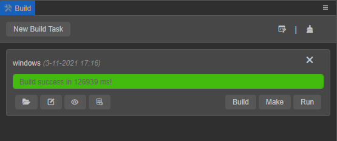
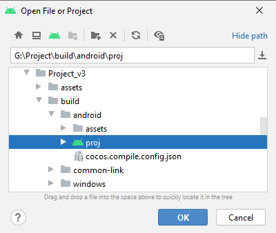
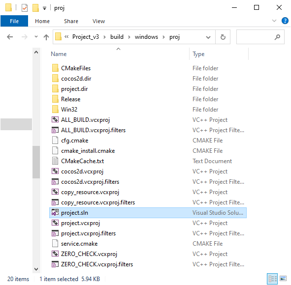
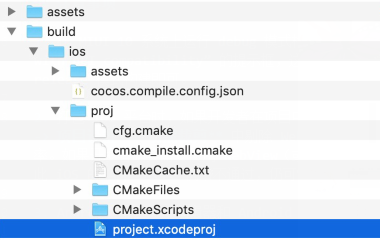

# Publishing to Native Platforms

To access the **Build** panel, go to the top menu bar and select **Project -> Build**.

Cocos Creator currently supports deployment to native platforms including **Android**, **iOS**, **Mac** and **Windows**. Options for publishing to **iOS**, **Mac**, and **Windows** are only accessible when using their corresponding operating systems.

## General Native Build Options

### Encrypt JS

Once enabled, scripts in the project will be encrypted and encapsulated in a .jsc file which can be found in the `assets` folder of the project directory. The original script files will be stored in the `script-backup` folder for debugging purposes and will not be added to the release package.

**JS Encryption Key**: Value will be used as the encryption key for script encryption and will be generated randomly at the project’s creation.

**Zip compression**: If enabled, scripts will be compressed, reducing package size.

#### Native Engine

Users may choose Cocos Creator’s built-in native engine or their custom typescript engine to deploy to native platforms. Click **Edit** to open the **Preferences** panel and enter the custom engine directory under the **[Engine Manager](../preferences/index.md#engine-manager)** tab.

#### Job System

Job System is managed by the internal mechanisms and does not require manual modifications. Should such need emerges, please take note:

1. TBB / TaskFlow gives varying performances depending on the execution environment and project specifications, thus should be selected accordingly.
2. Cocos Creator supports specific versions of TBB / TaskFlow for deployment. For more information, please see below in section **Compatibility**.

### Automatically Execute Next Step

At the bottom right of the **Build** panel, there are three buttons: **Build**, **Make**, and **Run**. By default, you need to click the corresponding button to perform the respective action.

If you want, you can click the **Link** button between two buttons, and it will turn into an **Arrow**. This means that the next step pointed to by the arrow will be automatically executed after the completion of the previous step. Clicking the arrow again will restore it to its previous state.

### Other Build Options

To publish to native platforms, you need to install and configure some necessary environments. For more details, please refer to [Setting up Native Development Environment](setup-native-development.md).

To view the common options for all platforms, please refer to [General Build Options](build-options.md).

To view platform-specific build options, please refer to:

[Build Options - Android](./android/build-options-android.md)
[Build Options - iOS](./ios/build-options-ios.md)
[Build Options - Windows](./windows/build-options-windows.md)
[Build Options - macOS](./mac/build-options-mac.md)

## Start the Build Process

With the builder properties set, click the **Build** button at the bottom right corner of the **Build** panel to start the build process.

While building is in progress, a blue progress bar will be displayed on the Build Tasks page in the Build panel. If the build is successfully done, the progress bar will reach 100% and turn green.

### Native Project Directory

The native project built by Cocos Creator includes the native common directory, native platform directory, and native project directory. For more details, please refer to the [Native Platform Secondary Development Guide](../../advanced-topics/native-secondary-development.md).

## Compile and Run

In Cocos Creator, you can compile and run your project through the buttons on the **Build** panel. You can also open the project in the corresponding IDE for each platform, such as Xcode for iOS and macOS, Android Studio for Android, or Visual Studio for Windows. This allows you to perform further compilation, running, debugging, and publishing tasks.

### Via Cocos Creator

After the build process is completed, click the **Make** button to start compiling, which will prompt the following message:

`make package YourProjectBuildPath success!`

> **Note**: When building targeting Android platform, it is needed to open the built project in Android Studio, download and install the missing modules and plug-ins as prompted first, then return to Cocos Creator and repeat the operations above.

After the "Make" process is complete, click the **Run** button next to it. Some unfinished compilation may still be ongoing at this point. Please wait patiently or check the progress through the log file. After compilation is done, users will get:

- Mac / Windows: Preview will be executed on desktop.
- Android: Preview can be executed on a USB-connected device provided the device has USB debugging enabled.
- iOS: Preview will be executed via a simulator, but it is recommended to execute on a device via Xcode.

### Via IDE

Users can access the build directory with the **folder** button at the lower left corner of each **build task** listed in the **Build** panel. Under `proj` folder in the build directory is a project file that can be opened with IDEs.

Open the project in the IDEs of their respective platform (Xcode for iOS, Android Studio for Android, Visual Studio for Windows, etc.) where users may continue with regular operations such as compilation, preview and release.

- **Android**

  

- **Windows**

  

- **iOS** and **Mac**

  

> **Note**: It is not advisable to do secondary development in IDEs at this point as they will be overridden if the project is rebuilt by Cocos Creator.

To learn more about debugging in IDEs, please refer to [Debugging JavaScript on Native Platforms](debug-jsb.md).

## Considerations

1. When running a debug build on MIUI 10, system may prompt the message "Detected problems with API compatibility." This issue will not emerge with release builds.

2. When deploying a project to iOS without WebView functionalities incorporated, please be sure to disable the WebView module in Cocos Creator at **Project -> Project Settings -> Feature Cropping**. This will noticeably increase the success rate of the project passing iOS App Store’s automatic submission review. If the project requires WebView or related third-party SDKs incorporated to function properly, it is likely to be flagged by the submission review system, in which case it is advisable to contact Apple for an appeal.

3. When building for Android, compilation output of Cocos Creator and Android Studio may differ in the following ways:

    - After the **Make** process is executed in Cocos Creator, the `build` folder will be generated in the release directory, and the .apk package will be generated in the `build\app\publish\` folder of the build directory.

    - After the project is compiled in Android Studio, the .apk package will be generated in the `proj\app\build\outputs\apk` folder.

4. Projects targeting Android and Android Instant are built with the same template. Build output can be found in the `build\android\proj` folder. Regarding this folder, please take note:

    - Code intended for the Android platform should be stored in the `app\src` folder. Third-party libraries should be stored separately in the `app\libs` folder. If these folders do not exist in the build directory, users can create them manually.

    - Code intended for the Android Instant should be stored in the `instantapp\src` folder. Third-party libraries should be stored separately in the `instantapp\libs` folder. If these folders do not exist in the build directory, users can create them manually.

    - Code and libraries shared by Android and Android Instant should be stored in the `src` and `libs` folders respectively. If these folders do not exist in the build directory, users can create them manually.

    When compiling for Android by clicking the **Make** button in the **Build** panel, `assembleRelease/Debug` will be executed by default. Similarly, `instantapp:assembleRelease/Debug` will be executed by default when compiling for Android Instant.
