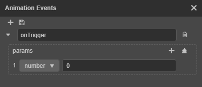

# 程序化控制动画

## 动画组件

动画组件管理了一组动画状态，用于控制各动画的播放、暂停、继续、停止、切换等。动画组件会为每一个动画剪辑都创建相应的 [动画状态](animation-state.md) 对象，动画状态用于控制需要在对象上使用的动画剪辑。

在动画组件中，动画状态是通过名称来标识的，每个动画状态的默认名称就是其动画剪辑的名称。

在脚本中为节点添加动画组件的方式如下：

```ts
import { Animation, Node } from 'cc';

function (node: Node) {
    const animationComponent = node.addComponent(Animation);
}
```

### 动画的播放与切换

#### 播放动画

动画组件通过 [play()](__APIDOC__/zh/class/Animation?id=play) 控制指定动画的播放，例如：

```ts
// 播放动画状态 'idle'
animationComponent.play('idle');
```

使用 `play` 播放动画时若未指定具体动画，并且设置了 `defaultClip`，则会播放 defaultClip 动画。若动画组件的 `playOnLoad` 也设置为 `true`，则动画组件将在第一次运行时自动播放 `defaultClip` 的内容。

```ts
// 未指定播放的动画，并且设置了 defaultClip 的话，则会播放 defaultClip 动画
animationComponent.play();
```

#### 切换动画

使用 `play` 接口播放一个动画时，如果此时还有其他的动画正在播放，则会立即停止其他动画的播放。这种切换是非常突兀的，在某些情况下，我们希望这种切换是“淡入淡出”的效果，那么便可以使用 [crossFade()](__APIDOC__/zh/class/Animation?id=crossfade)，在指定的周期内平滑地完成切换。例如：

```ts
// 播放动画状态 ‘walk’
animationComponent.play('walk');

/* ... */

// 在 0.3 秒内平滑地从走的动画切换为跑的动画
animationComponent.crossFade('run', 0.3);
```

`crossFade()` 的这种淡入淡出机制使得同一时刻可能有不止一个动画状态在播放。因此，动画组件没有 **当前动画** 的概念。

即便如此，动画组件仍提供了 `pause()`、`resume()`、`stop()` 方法，这些方法在暂停、继续以及停止正在播放的所有动画状态的同时，也暂停、继续以及停止动画的切换。

关于动画组件更多相关的控制接口，详情请参考 [类 `Animation`](__APIDOC__/zh/class/Animation)。

## 动画状态

动画组件只提供了一些简单的控制函数，大部分情况下是足够和易于使用的，但若想要得到更多的动画信息以及动画控制接口，需要使用 [动画状态](animation-state.md)。

## 帧事件

动画编辑器支持可视化编辑 [事件帧](animation-event.md)，也可以直接在脚本里添加帧事件。

`AnimationClip` 的 `events` 包含了此动画所有的帧事件，每个帧事件都具有以下属性：

```ts
{
    frame: number;
    func: string;
    params: any[];
}
```

- `frame`：表示事件触发的时间点，单位为秒。例如 `0.618` 就表示当动画到达第 0.618 秒时将触发事件。时间轴刻度单位之间的转换，详情请参考 [时间轴的刻度单位显示](animation-editor.md#%E6%97%B6%E9%97%B4%E8%BD%B4%E7%9A%84%E5%88%BB%E5%BA%A6%E5%8D%95%E4%BD%8D%E6%98%BE%E7%A4%BA)。
- `func`：表示事件触发时回调的函数名称。事件触发时，动画系统会搜索 **动画根节点中的所有组件**，若组件中有实现动画事件 `func` 中指定的函数，便会对其进行调用，并传入 `params` 中的参数。

例如，在动画时间轴的第 0.5s 添加了一个事件帧：



那么在脚本中实现的代码如下：

```ts
{
    frame: 0.5;
    func: 'onTrigger';
    params: [ 0 ];
}
```

### 示例

以下代码表示 `MyScript` 脚本组件所在节点的动画组件的默认动画剪辑在进行到第 0.5 秒时，将调用 `MyScript` 组件的 `onTriggered()` 方法并传递参数 `0`。

```ts
import { Animation, Component } from 'cc';
class MyScript extends Component {
    constructor() {

    }

    public start() {
        const animationComponent = this.node.getComponent(Animation);
        if (animationComponent && animationComponent.defaultClip) {
            const { defaultClip } = animationComponent;
            defaultClip.events.push({
                frame: 0.5, // 第 0.5 秒时触发事件
                func: 'onTriggered', // 事件触发时调用的函数名称
                params: [ 0 ], // 向 `func` 传递的参数
            });
        }
    }

    public onTriggered(arg: number) {
        console.log('I am triggered!');
    }
}
```

## 动画事件

除了 **动画编辑器** 中的帧事件提供了回调，动画系统还提供了动画事件回调方式。目前支持的回调事件包括：

- `PLAY`：开始播放时触发
- `STOP`：停止播放时触发
- `PAUSE`：暂停播放时触发
- `RESUME`：恢复播放时触发
- `LASTFRAME`：假如动画循环次数大于 1，当动画播放到最后一帧时触发。
- `FINISHED`：动画播放完成时触发

其定义枚举 `Animation.EventType` 内，以骨骼动画组件为例，代码示例如下：

```ts
import { _decorator, Component, Node, SkeletalAnimation, Animation, SkeletalAnimationState } from 'cc';
const { ccclass, property } = _decorator;

@ccclass('SkeletonAnimationEvent')
export class SkeletonAnimationEvent extends Component {
    start() {

        let skeletalAnimation = this.node.getComponent(SkeletalAnimation);
        skeletalAnimation.on(Animation.EventType.FINISHED, this.onAnimationFinished, this);
    }

    onAnimationFinished(type:Animation.EventType, state:SkeletalAnimationState){

    }
}
```

非骨骼动画，代码示例如下：

```ts
import { _decorator, Component, Node, Animation, AnimationState } from 'cc';
const { ccclass, property } = _decorator;

@ccclass('AnimationEvent')
export class AnimationEvent extends Component {
    
    start() {
        let animation = this.node.getComponent(Animation);
        animation.on(Animation.EventType.FINISHED, this.onAnimationEvent, this)
    }

    onAnimationEvent(type: Animation.EventType, state: AnimationState) {

    }
}
```

更多内容请参考 [Animation.EventType](__APIDOC__/zh/namespace/Animation?id=EventType)。
