# Hello World 项目

了解 Cocos Dashboard 以后，我们接下来看看如何创建和打开一个 Hello World 项目。

## 新建项目

在 Cocos Dashboard 的 **项目** 选项卡中，点击右下角的 **新建** 按钮，进入 **新建项目** 页面。选择 **empty** 项目模板，设置好项目名称和项目路径

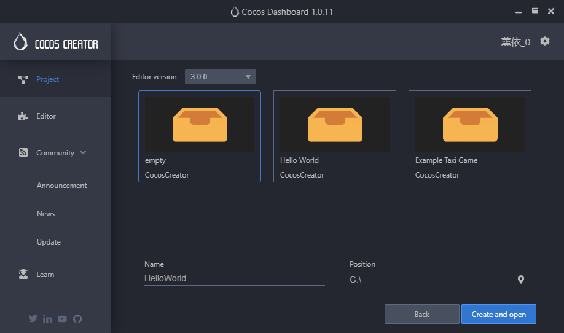

然后点击右下方的 **创建并打开** 按钮，就会自动以空项目模板创建项目并打开：

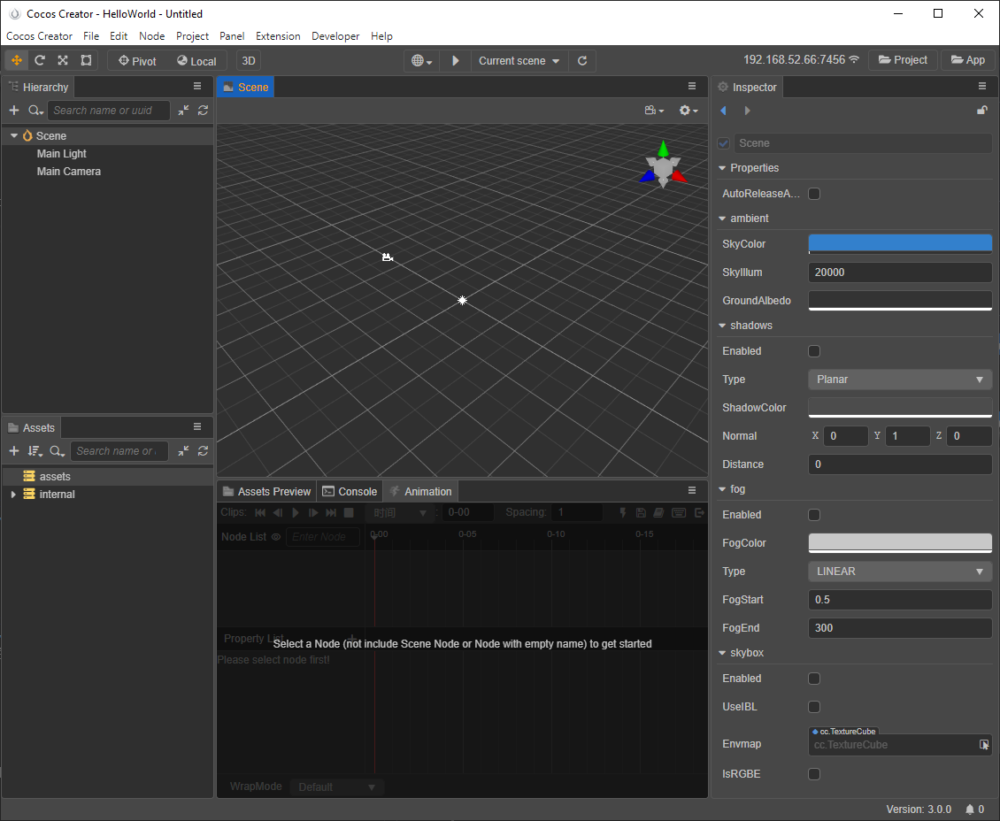

- **资源管理器**：显示了项目资源文件夹（`assets`）中的所有资源。
- **场景编辑器**：用于展示和编辑场景中可视内容的工作区域。
- **层级管理器**：用树状列表的形式展示场景中的所有节点和它们的层级关系，所有在 **场景编辑器** 中看到的内容都可以在 **层级管理器** 中找到对应的节点条目
- **属性检查器**：用于查看并编辑当前选中节点及其组件属性的工作区域
- **资源预览**：在 **资源管理器** 中选中资源，即可在 **资源预览** 面板中显示资源的缩略图。若选中资源所在的文件夹，即可显示文件夹下所有资源的缩略图，方便查看。
- **动画编辑器**：用于制作一些不太复杂的、需要与逻辑进行联动的动画，例如 UI 动画。
- **控制台**：用于显示报错、警告或其他 Cocos Creator 编辑器和引擎生成的日志信息。

关于编辑器各个面板，具体的内容请参考 [编辑器面板](../../editor/index.md)。

## 新建场景

在左下方的 **资源管理器** 面板中点击鼠标右键，选择 **创建 -> Scene**。

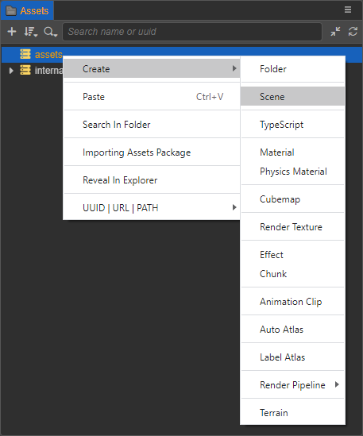

或者也可以直接点击左上角的 **+** 按钮，然后选择 **Scene**，即可在 **资源管理器** 的 `asset` 目录下新建一个场景：

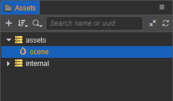

## 创建物体

在左上方的 **层级管理器** 面板中点击鼠标右键, 选择 **创建 -> 3D 对象 -> Cube 立方体**。或者也可以直接点击左上角的 **+** 按钮，然后选择 **3D 对象 -> Cube 立方体**。

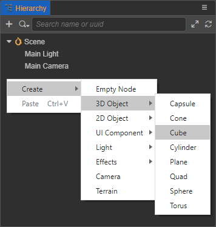

即可创建一个立方体并且显示在 **场景编辑器** 中：

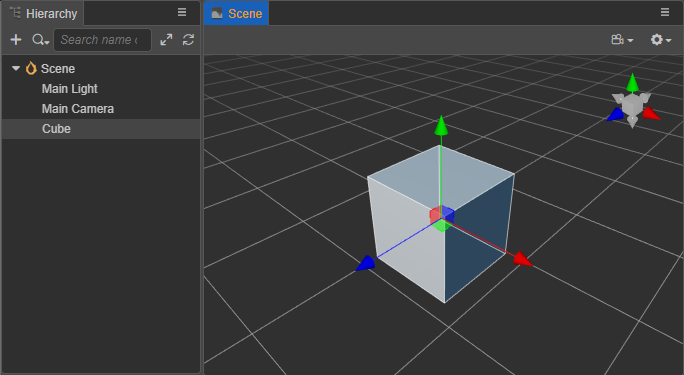

## 添加脚本

- 新建脚本

  在 **资源管理器** 面板中点击鼠标右键，选择 **创建 -> TypeScript**，然后命名为 “HelloWorld”，即可在 **资源管理器** 的 `asset` 目录下新建一个脚本。

  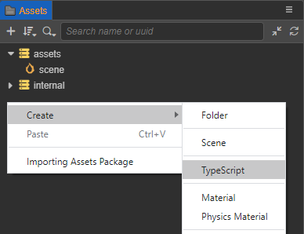

- 添加代码

  双击新建的脚本，脚本会自动在脚本编辑器中打开，前提是需要在编辑器菜单栏的 **Cocos Creator -> 偏好设置 -> 外部程序 -> 默认脚本编辑器** 中指定好使用的脚本编辑器。

  然后在脚本中添加 `start()` 函数，`start()` 函数会在组件第一次激活时调用，并输出 “Hello world”。

  ```ts
  import { _decorator, Component, Node } from 'cc';  const { ccclass, property } = _decorator;

  @ccclass('HelloWorld')
  export class HelloWorld extends Component {
      /* class member could be defined like this */
      // dummy = '';

      /* use `property` decorator if your want the member to be serializable */
      // @property
      // serializableDummy = 0;

      start () {
          // Your initialization goes here.
          console.info('Hello world');
      }

      // update (deltaTime: number) {
      //     // Your update function goes here.
      // }
  }
  ```

- 绑定脚本

  在 **层级管理器** 中选中创建的 Cube 节点，然后在 **属性检查器** 面板最下方点击 **添加组件 -> 自定义脚本 -> HelloWorld**，即可将脚本挂载到 Cube 节点上。或者也可以直接将脚本拖拽到 **属性检查器** 面板。

  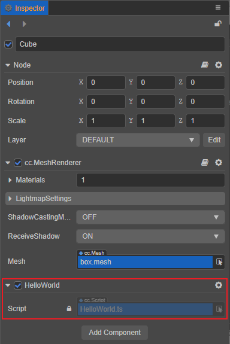

  > **注意**：场景设置完成后，切记要保存场景。

## 预览场景

简单的场景搭建完成后，就可以点击编辑器上方的 **预览** 按钮来预览游戏了。目前支持使用 **浏览器/模拟器** 进行预览。


以使用 **浏览器** 预览为例，Cocos Creator 会使用您的默认浏览器运行当前游戏场景，效果如下图所示：

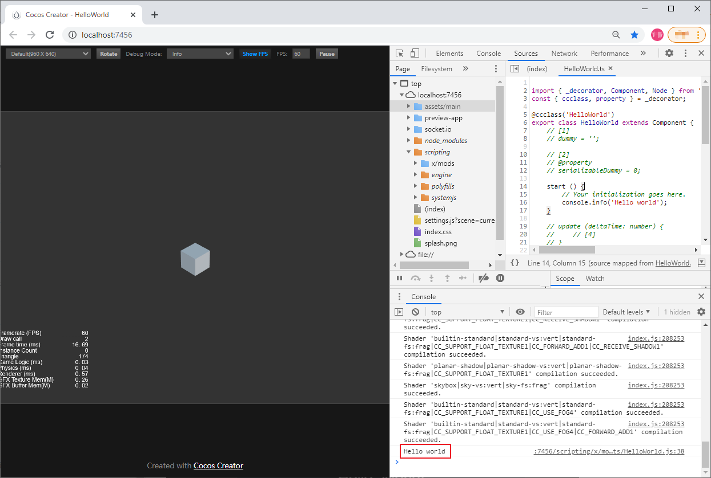

可以看到在浏览器的开发者工具中的日志信息中输出了 “Hello World”。

## 修改场景中的 Camera

在预览中我们可以看到立方体似乎有点太小了，这时便可以通过调整场景中的 Camera 来调整场景运行时显示的区域，Camera 代表的是游戏中的玩家视角。

- 首先在 **层级管理器** 中选中 **Main Camera** 节点，**场景编辑器** 中便会显示变换工具 Gizmo，以及玩家视角的小窗口。

  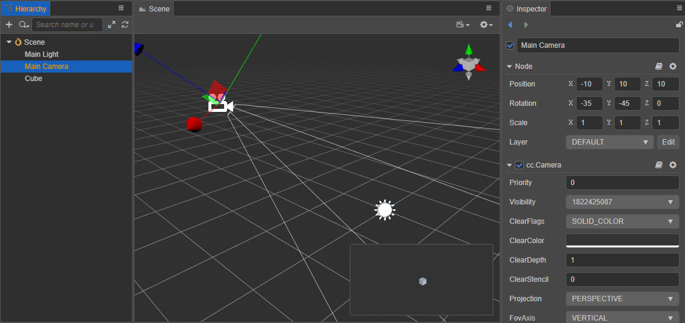

- 然后在 **场景编辑器** 中拖动 Gizmo，或者修改 **属性检查器** 中的 **Position** 属性，使玩家视角窗口中的立方体显示得更为明显。

  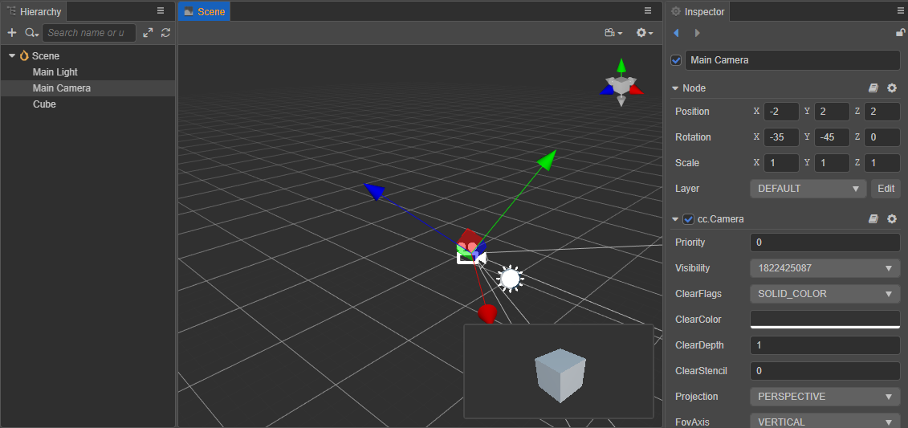

- 然后再次在浏览器中预览，可以看到场景中的立方体就很明显了

  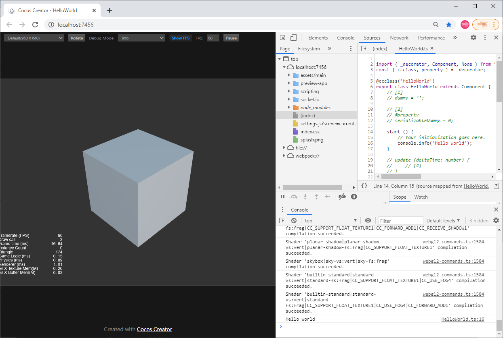
