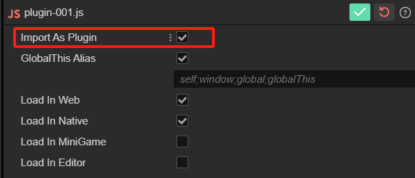

# External code support

> **Note**: as of v3.0, it is recommended to use the [module](modules/index.md) instead of the plugin script!

## Plugin Scripts

When a script resource is imported into the **Assets** panel and **Import as Plugin** is set in the **Inspector** panel, the script resource is called a **Plugin Script**. Plugin scripts are usually used to introduce third-party libraries. Currently, only JavaScript plugin scripts are supported.



Unlike other scripts in the project, Cocos Creator will not modify the content of the plug-in script, but some code may be inserted to adapt to Creator itself. In particular, Cocos Creator will shield the global variables `module`, `exports`, `define`.

### Import Options

Many third-party JavaScript libraries provide library functions in the form of global variables. These libraries often write global variables `window`, `global`, `self` and `this`.

However, these global variables are not necessarily cross-platform. For convenience, when importing plug-in scripts, the option **GlobalThis Alias** is provided. After opening, **Cocos Creator** will insert the necessary code to simulate these global variables. Example:

```js
(function() {
    const window = globalThis;
    const global = globalThis;
    const self = globalThis;

    (function() {
        /* Original code */
    }).call(this);

}).call(this);
```

Common global variables will be simulated by default. For special global variable aliases, you can add the corresponding variable name in the input box.

### Execution Timing

#### Execution environment

Developers can control whether plug-in scripts are executed in certain environments.

| Options | Affected Platform | Remarks |
| :--------- | :---------- | :---------- |
| **Load In Web** | Browser, Web page preview, Editor | Enabled by default, when disabled, it will be disabled with **Allow editor to load** |
| **Load In Editor** | Editor | Disabled by default. If other common scripts in the editor depend on the current script during the loading process, you need to manually enable this option. <br>After opening, local variables that are not declared in any function in the script will not be exposed as global variables, so global variables need to be defined with `window.abc = 0` to take effect. |
| **Load In Native** | Native platform, emulator preview | Enabled by default |
| **Load In MiniGame** | Minigame platform | Enabled by default. |

#### Order of execution

Plugin scripts will by default be executed after the engine starts and before the project scripts are loaded. The order between plugin scripts is sorted by default according to the naming of the plugin scripts themselves. Since 3.8.3, you can specify the priority order of the plugin scripts in the project settings. The scripts with the specified priority order will be reordered to meet the specified order after the default ordering.

> The modification interactions for specific project settings can be found in the [Project Settings Documentation](../editor/project/index.md)


For example, suppose there are plugin scripts with names: `1,2,3,4,5,6,7,8`, the default sort order will be from 1 - 8, if you specify the priority order of some of the scripts in the project settings: `8,3,1,7,5`, then the final sort result will be: `8,3,1,2,4,7,5,6`.

### Usability and Cross-Platform

The plug-in script is copied to the build directory almost intact, so the usability and cross-platform of the plug-in script are not guaranteed by **Cocos Creator**. For example, when plug-in scripts use language features that are not supported by certain platforms, errors will result, especially:

- **The target platform does not provide native node.js support**

  For example, many [npm](https://www.npmjs.com/) modules directly or indirectly depend on node.js, so they cannot be used after being published to native or web platforms.

- **Plugins that rely on the DOM API will not be able to publish to the native platform**

  A large number of front-end plug-ins can be used in web pages, such as jQuery, but they may depend on the browser's DOM API. Plugins that rely on these APIs cannot be used on the native platform.

### Interaction

Plug-in scripts and non-plug-in scripts cannot interact in the form of import. For example, even if the developer knows that their target platform actually supports CommonJS, nor can it be used in a non-plug-in script forcibly through the relative path of `require`.

Therefore, plug-in scripts generally communicate in the form of global variables (also known as IIFE module format), but the following points need to be noted:

- Developers should use global variables very carefully. When you want to use global variables, you should be very clear about what you are doing. We do not recommend abusing global variables. Even if you want to use them, it is best to ensure that global variables are read only.

- When adding global variables, please be careful not to have the same name with the existing global variables in the system.

- Developers can freely encapsulate or extend the **Cocos Creator** engine in the plug-in script, but this will increase the cost of team communication and make the script difficult to reuse.
