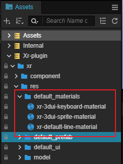

# Built-in Resources and Prefabs

After enabling the XR extension in the Cocos Creator Extension Manager, you can create XR-related objects just as the way you create a general node.

Right-click in the Hierarchy and select **Create -> XR**. On the right menu, you will see all the available XR prefabs that you can create instances of in the scene.

|Name|Description|Components|
| ---------------------------------------------- | --------------------------------------------------- | ----------------------------------- |
| XR Agent                | A proxy node in the virtual scene that represents information related to the real-world main character and controls the lifecycle of the XR main character in the virtual world. | TrackingOrigin                                               |
| XR HMD                  | 	An abstract node representing a head-mounted display device in the virtual world, based on the Camera object, used to synchronize input signals from the real-world head-mounted display and output the engine rendering result to the device. | Camera AudioSource HMDCtrl PoseTracker TargetEye |
| AR Camera               | An abstract representation of the camera on mobile devices with AR capabilities, used to map the camera's AR functionality to the physical device. | Camera PoseTracker ARCameraMgr                     |
| Ray Interactor          | A ray interactor used for long-distance interaction, including mapping of XR device controller I/O and ray interaction functionality. | PoseTracker XRController RayInteractor Line   |
| Direct Interactor       | An interactor used for close-range direct interaction, which also includes mapping of XR device controller I/O and interaction functionality. | PoseTracker XRController DirectInteractor          |
| Gaze Pointer Interactor | An interactor used for gaze-based interaction, follows head movement, and triggers interaction based on gaze duration. | UITransform RenderRoot2D XRGazeInteractor          |
| ScreenTouchInteractor | An interactor for screen gesture interaction on handheld mobile devices, converts screen gestures into interaction behaviors with objects in the scene. | ScreenTouchInteractor                                        |
| Locomotion Checker      | A motion checker that acts as an arbiter for all virtual motion drivers to access the XR Agent, ensuring the maintenance of a unique motion state within a fixed time. | LocomotionChecker                                            |
| Teleportable            | An interaction object that can trigger teleportation interaction with the interactor, allowing the XR Agent to be teleported to a location related to this object. | Teleportable InteractableEvents                         |
| Simple Interactable     | A simple interactive object where users can customize and extend arbitrary interaction behaviors. | InteractableEvents                                           |
| Grab Interactable       | An interactable object that supports grabbing behavior with the interactor.                           | RigidBody GrabInteractable InteractableEvents      |
| XR Simulator            | Used for previewing XR content, provides web-based and wireless streaming options.                | XRInteractiveSimulator                                       |
| XR Video Player         | An XR video player that supports playing videos in windowed, 180-degree, and 360-degree modes in space. | XRVideoPlayer XRVideoController XRVideoCaption     |
| XRUI                    | 3D UI that can be rendered and interacted with in space.                                | RaycastChecker RenderRoot2D BoxCollider            |
| Plane Tracking          | Empowers the application with plane recognition capabilities, using the device's AR capabilities to identify plane features in the physical world during runtime, and visualizes and displays these plane data in the application. | ARPlaneTracking                                              |
| Image Tracking          | Empowers the application with image recognition capabilities, using the device's AR capabilities to recognize 2D image resources during runtime. | ARImageTracking                                              |
| Meshing                 | Empowers the application with environment reconstruction capabilities, creating 3D meshes based on the real-world environment.           | ARMeshing                                                    |

## Built-in Resources

After enabling the XR extension, the XR prefabs, materials, models, and other resources will be added to the built-in resource database (xr-plugin) and can be directly used by users. The specific location is shown in the following image.

### Prefabs

### Materials

### Models

